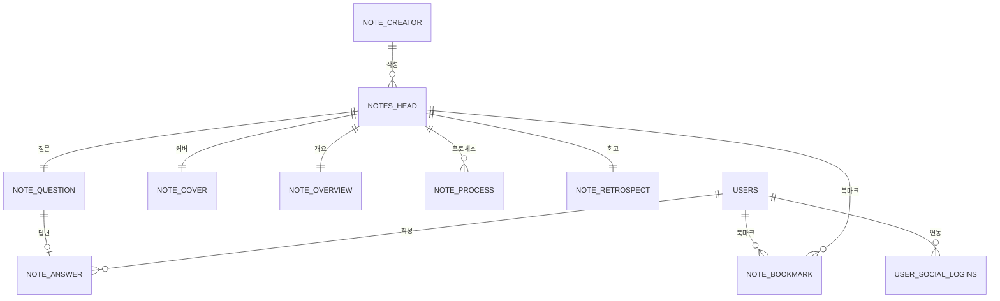

# ERD 개요

현재 코드베이스(Spring Data JPA 엔티티 및 Flyway 마이그레이션 기준)를 기반으로 한 ERD 표입니다.

## users (`User`)

| 컬럼 | 타입 | 제약조건 및 설명 |
| --- | --- | --- |
| `id` | BIGINT | PK, `IDENTITY` 전략 |
| `email` | VARCHAR(50) | NOT NULL, UNIQUE |
| `password` | VARCHAR | NOT NULL |
| `username` | VARCHAR(30) | NOT NULL |
| `role` | VARCHAR | NOT NULL, enum(`USER`, `ADMIN`) 값 저장 |
| `enabled` | BOOLEAN | NOT NULL |
| `account_non_expired` | BOOLEAN | NOT NULL |
| `account_non_locked` | BOOLEAN | NOT NULL |
| `credentials_non_expired` | BOOLEAN | NOT NULL |
| `token_version` | INTEGER | NOT NULL, 기본값 0 |
| `created_at` | TIMESTAMP | 생성 감사 필드(`BaseTimeEntity`) |
| `updated_at` | TIMESTAMP | 수정 감사 필드(`BaseTimeEntity`) |

## user_social_logins (`UserSocialLogin`)

| 컬럼 | 타입 | 제약조건 및 설명 |
| --- | --- | --- |
| `id` | BIGINT | PK, `IDENTITY` 전략 |
| `user_id` | BIGINT | NOT NULL, FK → `users.id`, `ON DELETE CASCADE` |
| `provider` | VARCHAR(20) | NOT NULL |
| `provider_id` | VARCHAR(255) | NOT NULL, UNIQUE (`provider`, `provider_id`) |
| `created_at` | TIMESTAMP | Flyway 마이그레이션에서 기본값 `CURRENT_TIMESTAMP` |
| `updated_at` | TIMESTAMP | Flyway 마이그레이션에서 기본값 `CURRENT_TIMESTAMP` |

## note_creator (`NOTE_CREATOR`)

| 컬럼 | 타입 | 제약조건 및 설명 |
| --- | --- | --- |
| `id` | BIGINT | PK, `BIGSERIAL` |
| `name` | VARCHAR(60) | NOT NULL |
| `bio` | VARCHAR(100) | 작가 소개 |
| `job_title` | VARCHAR(60) | 직위/직함 (작가 소개와 별개 항목) |
| `profile_image_url` | VARCHAR(255) | 작가 프로필 이미지 URL |
| `instagram_url` | VARCHAR(255) | 선택 |
| `youtube_url` | VARCHAR(255) | 선택 |
| `behance_url` | VARCHAR(255) | 선택 |
| `x_url` | VARCHAR(255) | 선택 |
| `blog_url` | VARCHAR(255) | 선택 |
| `news_url` | VARCHAR(255) | 선택 |

> [2025-11-05] `job_title`과 `bio`를 별도 컬럼으로 명시하고 `profile_image_url` 컬럼 정의를 추가했습니다. `notes_head.creator_id` 설명도 애플리케이션 검증 조건에 맞게 조정했습니다.

## notes_head (`NOTES_HEAD`)

| 컬럼 | 타입 | 제약조건 및 설명 |
| --- | --- | --- |
| `id` | BIGINT | PK, `BIGSERIAL` |
| `status` | VARCHAR(20) | NOT NULL, `IN_PROGRESS`/`COMPLETED`/`PUBLISHED`/`ARCHIVED` |
| `tag_text` | VARCHAR(60) | 태그 요약(선택) |
| `source_url` | VARCHAR(255) | 참고용 외부 링크 |
| `creator_id` | BIGINT | FK → `note_creator.id` (DB 선택, 애플리케이션에서는 필수) |
| `created_at` | TIMESTAMP WITH TIME ZONE | 기본값 `CURRENT_TIMESTAMP` |
| `updated_at` | TIMESTAMP WITH TIME ZONE | 기본값 `CURRENT_TIMESTAMP` |
| `published_at` | TIMESTAMP WITH TIME ZONE | 게시 시각(선택) |
| `archived_at` | TIMESTAMP WITH TIME ZONE | 아카이브 시각(선택) |

## note_cover (`NOTE_COVER`)

| 컬럼 | 타입 | 제약조건 및 설명 |
| --- | --- | --- |
| `note_id` | BIGINT | PK, FK → `notes_head.id`, `ON DELETE CASCADE` |
| `title` | VARCHAR(30) | NOT NULL |
| `teaser` | VARCHAR(100) | NOT NULL |
| `main_image_url` | VARCHAR(255) | NOT NULL |
| *(cardinality)* |  | 한 노트당 정확히 1행 유지 |

## note_overview (`NOTE_OVERVIEW`)

| 컬럼 | 타입 | 제약조건 및 설명 |
| --- | --- | --- |
| `note_id` | BIGINT | PK, FK → `notes_head.id`, `ON DELETE CASCADE` |
| `section_title` | VARCHAR(30) | NOT NULL |
| `body_text` | VARCHAR(200) | NOT NULL |
| `image_url` | VARCHAR(255) | NOT NULL |
| *(cardinality)* |  | 한 노트당 정확히 1행 유지 |

## note_process (`NOTE_PROCESS`)

| 컬럼 | 타입 | 제약조건 및 설명 |
| --- | --- | --- |
| `note_id` | BIGINT | FK → `notes_head.id`, `ON DELETE CASCADE` |
| `position` | SMALLINT | PK 구성, 1 또는 2 (`CHECK`) |
| `section_title` | VARCHAR(30) | NOT NULL |
| `body_text` | VARCHAR(500) | NOT NULL |
| `image_url` | VARCHAR(255) | NOT NULL |
| *(cardinality)* |  | 한 노트당 정확히 2행 (position 1,2) |

## note_retrospect (`NOTE_RETROSPECT`)

| 컬럼 | 타입 | 제약조건 및 설명 |
| --- | --- | --- |
| `note_id` | BIGINT | PK, FK → `notes_head.id`, `ON DELETE CASCADE` |
| `section_title` | VARCHAR(30) | NOT NULL |
| `body_text` | VARCHAR(200) | NOT NULL |
| *(cardinality)* |  | 한 노트당 정확히 1행 유지 |

## note_question (`NOTE_QUESTION`)

| 컬럼 | 타입 | 제약조건 및 설명 |
| --- | --- | --- |
| `id` | BIGINT | PK, `BIGSERIAL` |
| `note_id` | BIGINT | UNIQUE, FK → `notes_head.id`, `ON DELETE CASCADE` |
| `question_txt` | VARCHAR(100) | NOT NULL |
| *(cardinality)* |  | 한 노트당 정확히 1행 유지 |

## note_answer (`NOTE_ANSWER`)

| 컬럼 | 타입 | 제약조건 및 설명 |
| --- | --- | --- |
| `id` | BIGINT | PK, `BIGSERIAL` |
| `question_id` | BIGINT | UNIQUE, FK → `note_question.id`, `ON DELETE CASCADE` |
| `user_id` | BIGINT | FK → `users.id`, NULL 허용(게스트 대비) |
| `answer_txt` | VARCHAR(200) | 답변 내용 (NULL 가능) |
| `created_at` | TIMESTAMP WITH TIME ZONE | 기본값 `CURRENT_TIMESTAMP` |
| `updated_at` | TIMESTAMP WITH TIME ZONE | 기본값 `CURRENT_TIMESTAMP` |
| *(cardinality)* |  | 질문당 최대 1행 |

## note_bookmark (`NOTE_BOOKMARK`)

| 컬럼 | 타입 | 제약조건 및 설명 |
| --- | --- | --- |
| `id` | BIGINT | PK, `BIGSERIAL` |
| `note_id` | BIGINT | NOT NULL, FK → `notes_head.id`, `ON DELETE CASCADE` |
| `user_id` | BIGINT | NOT NULL, FK → `users.id`, `ON DELETE CASCADE` |
| `created_at` | TIMESTAMP WITH TIME ZONE | 기본값 `CURRENT_TIMESTAMP` |
| *(보조 제약)* |  | `UNIQUE(note_id, user_id)`로 중복 북마크 차단 |
## 관계 요약

| 출발 테이블 | 관계 | 도착 테이블 | 설명 |
| --- | --- | --- | --- |
| `users.id` | 1 ── `*` | `user_social_logins.user_id` | 한 사용자 계정은 여러 소셜 로그인 계정을 가질 수 있음 (`ON DELETE CASCADE`) |
| `note_creator.id` | 1 ── `*` | `notes_head.creator_id` | 노트는 선택적으로 작가에 연결됨 (작성자 미등록 가능) |
| `notes_head.id` | 1 ── `1` | `note_cover.note_id` | 노트 기본 정보와 커버 정보 1:1 연결 (`ON DELETE CASCADE`) |
| `notes_head.id` | 1 ── `1` | `note_overview.note_id` | 노트당 단일 개요 섹션 유지 |
| `notes_head.id` | 1 ── `2` | `note_process.note_id` | 노트당 정확히 2개의 프로세스 단계 (`position` 1,2) |
| `notes_head.id` | 1 ── `1` | `note_retrospect.note_id` | 노트당 단일 회고 섹션 유지 |
| `notes_head.id` | 1 ── `1` | `note_question.note_id` | 노트당 단일 질문 유지 |
| `note_question.id` | 1 ── `0..1` | `note_answer.question_id` | 질문당 답변 최대 1개, 삭제 시 cascade |
| `users.id` | 1 ── `*` | `note_answer.user_id` | 사용자당 여러 답변 작성 가능 (NULL 허용) |
| `users.id` | 1 ── `*` | `note_bookmark.user_id` | 사용자별 북마크 다수, 중복 방지 UNIQUE |
| `notes_head.id` | 1 ── `*` | `note_bookmark.note_id` | 노트별 북마크 다수 (`ON DELETE CASCADE`) |

---

## 관계 다이어그램 (Notion 공유용)

| FROM | 관계 | TO | 설명 |
| --- | --- | --- | --- |
| USERS | ⟶ | USER_SOCIAL_LOGINS | 사용자 ↔ 소셜 로그인 계정 (다대일) |
| NOTE_CREATOR | ⟶ | NOTES_HEAD | 작가가 여러 노트를 관리 |
| NOTES_HEAD | ⟶ | NOTE_COVER | 노트 ↔ 커버 1:1 |
| NOTES_HEAD | ⟶ | NOTE_OVERVIEW | 노트 ↔ 개요 1:1 |
| NOTES_HEAD | ⟶ | NOTE_PROCESS | 노트 ↔ 프로세스 1:2 (position 1,2) |
| NOTES_HEAD | ⟶ | NOTE_RETROSPECT | 노트 ↔ 회고 1:1 |
| NOTES_HEAD | ⟶ | NOTE_QUESTION | 노트 ↔ 질문 1:1 |
| NOTE_QUESTION | ⟶ | NOTE_ANSWER | 질문 ↔ 답변 1:0..1 |
| USERS | ⟶ | NOTE_ANSWER | 사용자 ↔ 답변 다대일 |
| USERS | ⟶ | NOTE_BOOKMARK | 사용자 ↔ 북마크 다대일 |
| NOTES_HEAD | ⟶ | NOTE_BOOKMARK | 노트 ↔ 북마크 다대일 |
