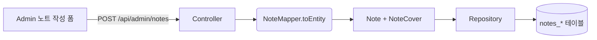
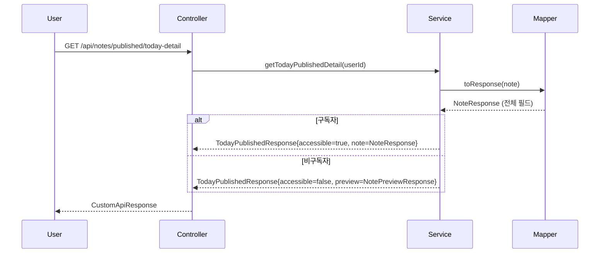
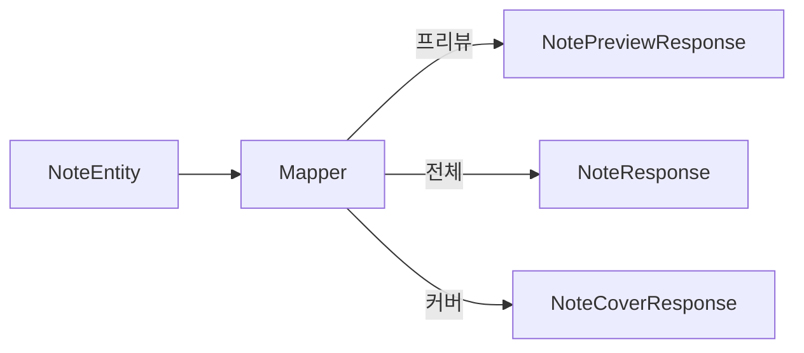
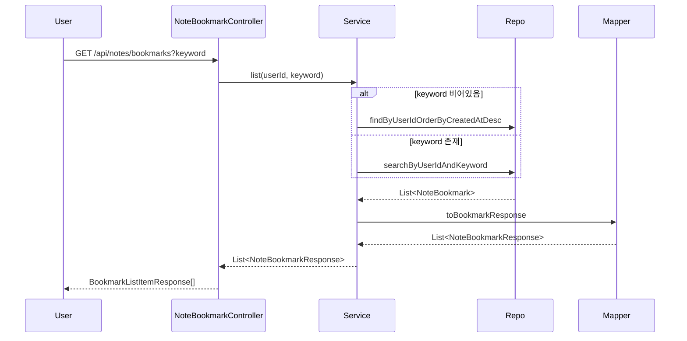

# Frontend Payload Review (최종 점검용)

> 기준: 2024-06-XX, 커밋 직전 프론트 연동 데이터 구조 확인  
> 범위: 노트 생성/조회 API, 구독자별 응답 매퍼, 북마크 목록/검색

---

## 1. 노트 생성 (Admin → 노트 작성 화면)

### 요청 DTO `NoteCreateRequest`
- `status`: `IN_PROGRESS` / `COMPLETED`
- `tagText`: optional (길이 60)
- `cover`: `NoteCoverDto`
  - `title`
  - `teaser`
  - `mainImageUrl`
  - `creatorName?`
  - `creatorJobTitle?`
- `overview` / `retrospect` / `processes(2개)` / `question`
- `creatorId` *(필수)*
- `externalLink` *(선택)*

> **주의 (FAQ 정리)**  
> 1. `creatorName`/`creatorJobTitle`은 **요청 시 optional**이다. Admin 작성 화면에서는 이 필드를 이용해 커버 미리보기 카드(제목·이미지·작가 정보)를 즉시 그리지만, DB에 실제로 저장되는 값은 `creatorId`를 통해 연결된 Creator 엔티티의 필드다.  
> 2. “프리뷰 카드를 미리 그린다”는 의미는, Admin이 폼에 입력한 값으로 실제 커버 카드 UI를 즉시 렌더링해 보여준다는 뜻이다. 같은 DTO를 재사용하면 별도 뷰 모델 없이 값 바인딩이 가능하다.  
> 3. 저장 이후 조회 시에는 `NoteMapper`가 `note.creator` 엔티티에서 이름/직함을 읽어 `NoteCoverResponse`와 `NoteResponse`에 반드시 채워서 내려준다.  
> 4. 따라서 프론트가 받는 응답에는 `creatorName`/`creatorJobTitle`이 항상 포함된다. DTO에 optional 표시를 둔 이유는 “요청에는 선택, 응답에는 필수” 상황을 구분하기 위함이다.

---

## 2. 노트 단건 조회 & Today Published (구독자 여부)

### `NoteResponse` (프론트 전달; `cover.publishedDate`는 today-cover/today-preview/today-detail 커버 영역에서 사용, 나머지 타임스탬프는 향후 UX 확장 대비)
- `id`, `status`, `tagText`
- `cover: NoteCoverResponse`
  - `title`, `teaser`, `mainImageUrl`, `creatorName`, `creatorJobTitle`, `publishedDate`
  - `NoteCoverDto`에도 동일 필드 존재하여 생성/수정 시 재사용
- `overview`, `retrospect`, `processes(2)`, `question`, `answer`
- `creatorId`, `creatorJobTitle` *(매퍼에서 Creator 정보 추출)*
- `externalLink`, `creator`(Summary)
- `publishedAt`, `archivedAt`, `createdAt`, `updatedAt`
  - `cover.publishedDate`: today-cover / today-preview / today-detail 커버 UI에서 “게시일” 표시용으로 사용
  - `publishedAt`: 노트 엔티티의 실제 게시 일시(yyyy-MM-dd)로 리스트/정렬 판단 용도
  - `archivedAt`, `createdAt`, `updatedAt`: 현재 화면에서는 미사용이지만 향후 “업로드 시간”, “히스토리 정렬” 등의 UX 확장에 대비해 유지

### `TodayPublishedResponse`
- `accessible` (구독자 여부)
- `note`: `NoteResponse | null`
- `preview`: `NotePreviewResponse | null` (비구독자일 때 커버 + 개요 100자 + creator summary)

### 지난 노트 상세 / 프리뷰 (단일 엔드포인트)
- `GET /api/notes/archived/{id}`
  - 응답: `ArchivedNoteViewResponse { accessible, note?, preview? }`
  - **유료 구독자(`accessible=true`)**: `note` 필드에 `NoteResponse` 전체가 들어오고 `preview=null`
  - **비구독자(`accessible=false`)**: `note=null`, `preview`에 `NotePreviewResponse` (커버 + 개요 100자 + creator summary) → 프론트는 프리뷰 화면과 “구독하고 전체 보기” CTA를 렌더링

---

## 3. 구독자별 응답 매퍼

### 매핑 규칙
- `NoteMapper.toResponse`
  - Creator 정보가 있을 경우
    - `creatorId = creator.id`
    - `creatorJobTitle = creator.jobTitle`
    - `cover.creatorName`, `cover.creatorJobTitle` 도 동일 값
  - `NoteExternalLinkDto` 생성: `note.sourceUrl` 존재 시 only
- `NoteMapper.toPreview`
  - `overview`: `NoteOverviewDto` 복제 후 `bodyText` 100자 제한
  - `cover.teaser`: today-preview/today-detail에서는 `null` 처리
- `toArchivedSummary`
  - `NoteCover.title` & `mainImageUrl`
  - `creatorName`
  - `publishedDate = note.publishedAt.toLocalDate()`

---

## 4. 북마크 목록/검색 API (USER/ADMIN)

### 검색 로직 (`searchByUserIdAndKeyword`)
- 조인: `note_bookmark` → `note` → `note_cover` / `note_creator`
- 조건: `lower(cover.title)`, `lower(note.tagText)`, `lower(creator.name)` 중 하나라도 `LIKE %keyword%`
- 정렬: `bookmark.createdAt DESC`

### DTO 필드 비교
| 레벨 | 필드 |
|------|------|
| `NoteBookmarkResponse` (Service 내부) | `bookmarkId`, `noteId`, `title`, `mainImageUrl`, `tagText`, `creatorName`, `bookmarkedAt` |
| `BookmarkListItemResponse` (프론트 노출) | `noteId`, `title`, `mainImageUrl`, `creatorName`, `tagText` *(UI는 제목+이미지+작가명만 노출, tagText는 검색 하이라이트 용도)* |

---

## 5. 전달 데이터 요약표

| API/기능 | 프론트 전달 DTO | 핵심 필드 |
|----------|----------------|-----------|
| `POST /api/admin/notes` | `NoteCreateRequest` | status, tagText, cover(title/teaser/mainImageUrl/creatorName?/creatorJobTitle?), overview, retrospect, processes(2), question, creatorId, externalLink |
| `GET /api/notes/published/today-detail` | `TodayPublishedResponse` → `NoteResponse`/`NotePreviewResponse` | NoteResponse 전체 필드(cover 포함), preview는 커버 + overview(본문 100자) |
| `GET /api/notes/archived/{id}` | `ArchivedNoteViewResponse` | `accessible` flag에 따라 `NoteResponse` 또는 `NotePreviewResponse` |
| `GET /api/notes/bookmarks?keyword` | `BookmarkListItemResponse[]` | noteId, title, mainImageUrl, creatorName, tagText (검색 결과 강조용) |

---

## 6. 체크리스트 (커밋 전 확인)
1. `NoteResponse`/`NoteCoverResponse`/`NotePreviewResponse` 필드가 문서/프론트 타입 정의와 일치하는지 확인. (`feature_notes_frontend_plan.md` 참고)
2. `BookmarkListItemResponse`의 `tagText` 추가가 프론트 코드에도 반영되었는지 확인.
3. 지난 노트 목록(`ArchivedNoteSummaryResponse`)이 `creatorName`, `publishedDate`를 제공하며, 프론트는 제목/이미지/작가명만 렌더링한다는 점을 공유.
4. 새로운 문서(`bookmark_search_change_summary.md`, `note_response_payload_change_summary.md`, `note_cover_dto_change_summary.md`)와 이 문서를 레포에 포함해 커밋한다.
