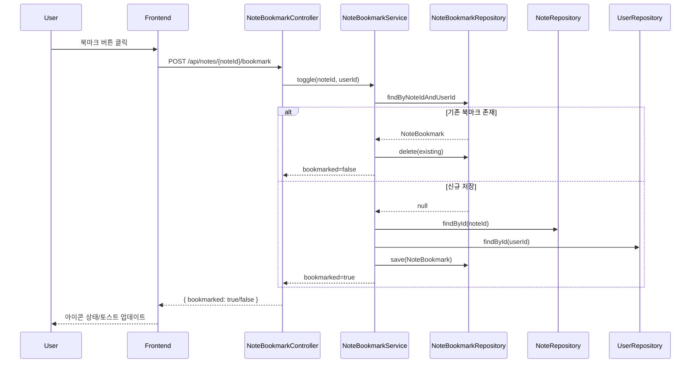
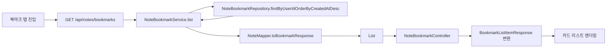
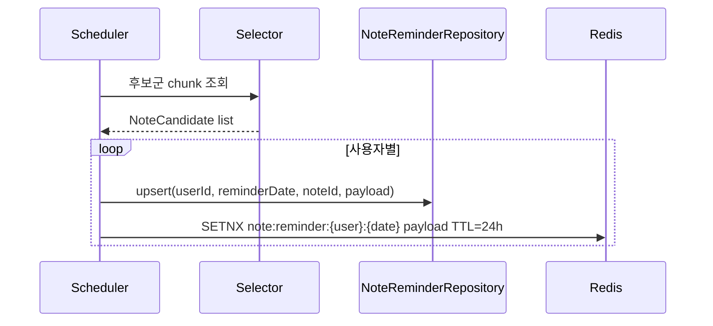
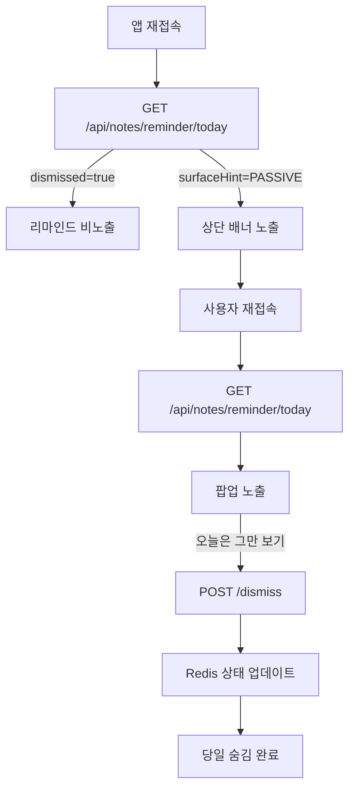

[#3] Presentation Deck: 노트 북마크 아키텍처

---

## 1. 목표와 사용자 가치
- **목표**: 사용자가 관심 있는 노트를 저장/해제하고, 언제든지 리스트에서 다시 찾아볼 수 있도록 지원.
- **주요 시나리오**
  - 노트 상세에서 북마크 버튼 토글.
  - 마이 페이지/북마크 탭에서 저장한 노트 카드 목록 확인.
- **연관 팀 협업 포인트**: 디자인(아이콘 상태, 애니메이션), PM(목록 정렬·노출 정책).

---

## 2. 구성 요소와 책임
| 레이어 | 역할 | 주요 클래스/컴포넌트 |
|--------|------|-----------------------|
| Controller | REST 엔드포인트, 인증, 응답 DTO 조립 | `NoteBookmarkController` |
| Service | 토글 비즈니스 로직, 사용자/노트 검증 | `NoteBookmarkService` |
| Repository | 북마크 존재 여부 및 목록 조회 | `NoteBookmarkRepository` |
| Domain | 북마크 엔티티, 생성 시타임스탬프 자동 기록 | `NoteBookmark` |
| Mapper | Note → Bookmark 카드 DTO 변환 | `NoteMapper.toBookmarkResponse` |

---

## 3. 데이터 모델
- **엔티티**: `NoteBookmark`
  - 필드: `id`, `note`, `user`, `createdAt`.
  - 생성 시점에 `Asia/Seoul` 기준 타임스탬프 저장 → “저장한 순” 정렬을 위한 기준.
- **연관 관계**: `NoteBookmark` ↔ `Note` (N:1), `NoteBookmark` ↔ `User` (N:1).
- **Repository 메소드**
  - `findByNoteIdAndUserId`: 토글 시 이미 존재하는지 확인.
  - `findByUserIdOrderByCreatedAtDesc`: 목록 조회, 최신 저장 순.

---

## 4. API 설계
| Endpoint | 메서드 | 설명 | 권한 | 응답 |
|----------|--------|------|------|------|
| `/api/notes/{noteId}/bookmark` | POST | 북마크 토글 | USER/ADMIN | `{ "bookmarked": true/false }` |
| `/api/notes/bookmarks` | GET | 사용자 북마크 목록/검색 (`keyword` 선택) | USER/ADMIN | `List<BookmarkListItemResponse>` |

- **토글 응답 규칙**: `true`면 북마크가 생성된 상태, `false`면 삭제된 상태. 프론트는 이 값으로 아이콘 상태를 결정.
- **목록 응답 DTO**: `BookmarkListItemResponse` (노트 ID, 제목, 메인 이미지, 작가명, 태그 텍스트) → 카드 UI 구성 요소와 1:1 매핑(현재는 제목/이미지/작가명만 노출).

---

## 5. 토글 플로우 (Mermaid)


---

## 6. 북마크 목록 플로우 (Mermaid)


---

## 7. UX 세부 사항
- **아이콘/애니메이션**: `bookmarked=true`일 때 채워진 아이콘, `false`일 때 비어있는 아이콘. 토글 시 스케일 업 애니메이션 권장.
- **토스트 메시지**: “북마크에 추가했어요”, “북마크에서 제거했어요” 등 긍정 문구 사용.
- **리스트 정렬**: `createdAt DESC` → 가장 최근에 저장한 노트가 상단에 노출.
- **빈 상태 화면**: 북마크가 없을 때 참고 노트 추천 영역을 디자인팀이 구성.

---

## 8. 예외 및 에러 처리
- 노트가 없을 때: `NoteNotFoundException` → 404, “이미 삭제된 노트입니다” 안내.
- 사용자 정보 미존재: `UserNotFoundException` → 인증 만료 상황 대비.
- 중복 북마크 방지: 토글 로직으로 해결, 추가적인 UNIQUE 제약 필요 시 DB 레벨(UNIQUE (note_id, user_id)) 고려.

---

## 9. 확장 아이디어
- **폴더/태그**: 북마크를 카테고리별로 묶을 수 있도록 추가 테이블 설계.
- **정렬 옵션**: 제목순/작성순 등 정렬 파라미터 추가.
- **공유 기능**: 북마크 목록에서 바로 공유 링크 생성.
- **분석 로그**: 북마크 추가/삭제 이벤트를 데이터 파이프라인에 전달해 인기 노트 분석.

---

## 10. 발표용 핵심 메시지
1. **단순한 토글 구조**로 안정적이며, 프론트에서 UI 피드백을 즉시 반영 가능.
2. **Service + Mapper** 조합으로 목록 응답이 프론트 디자인 스펙과 정확히 일치.
3. **확장성 고려**: 추후 즐겨찾기 폴더, 추천 등 기능 확장 기반을 제공.

---

## 11. 디자인팀용 요약
- **토글 인터랙션**
  - 북마크 버튼 클릭 → 서버에서 최종 상태(`bookmarked=true/false`)를 반환.
  - 디자인 포인트: 채워진/비어있는 아이콘 상태, 클릭 시 스케일 업 애니메이션, 토스트 문구(“북마크에 추가했어요” 등).
  - 오류 상황(노트 삭제, 권한 없음)에 대비한 경고 메시지 UI 준비.
- **목록 화면**
- `BookmarkListItemResponse`가 제공하는 데이터: 노트 ID, 제목, 대표 이미지, 작가명, 태그 텍스트 → 카드 레이아웃에선 제목/이미지/작가명만 노출하고, 태그 텍스트는 검색 필터용으로 사용.
  - 최신 순 정렬(가장 최근에 저장한 노트가 상단) → 디자인은 시간 순을 강조하는 배지/태그 사용 가능.
  - 빈 상태(북마크 없음) UI: “저장한 노트가 없어요” 안내 + 추천 노트 링크 영역 등 기획과 협업.
- **피드백 & 상태 유지**
  - 토글 이후 서버 응답을 기반으로 아이콘 상태를 즉시 반영하고, 스켈레톤 없이 자연스럽게 전환.
  - 북마크 목록에서 삭제 시에도 같은 API 사용 → 카드가 사라지는 애니메이션/Undo 버튼 여부 결정.
  - 모바일/데스크톱 디자인 차이를 고려해, 리스트가 긴 경우 무한 스크롤 또는 페이지네이션을 기획팀과 협의.

---

## 12. 하루 1회 리마인드 노트 랜덤 재노출 기능 계획

### 12.1 기능 개요
- **목표**: 사용자가 과거에 북마크했거나 작가 질문에 답했던 노트를 하루 한 번 랜덤으로 리마인드하여 재참여를 유도한다.
- **업데이트 시점**: 매일 00:00 (KST) 배치가 실행되어 사용자별로 서로 다른 노트를 선택 후 24시간 동안 고정 노출.
- **노출 정책**: 당일 배포된 리마인드 노트는 같은 날 앱 재접속 시에도 동일 콘텐츠 유지, 다음날 00:00에 갱신.
- **사용자 제어**: 팝업에서 “오늘 하루 더 이상 보지 않기”를 누르면 해당 날짜 동안만 숨김, 자정에 상태 초기화.

### 12.2 데일리 타임라인
| 시점 | 동작 | 비고 |
|------|------|------|
| 00:00 | `NoteReminderScheduler`가 유저별 후보군에서 랜덤 1건을 선택해 `note_reminder_pot`에 upsert | ShedLock/분산락으로 단일 실행 |
| 00:01 | 선택된 레코드를 Redis `note:reminder:{userId}:{yyyymmdd}` 키로 캐싱, TTL 24h | 캐시 miss 시 DB fallback |
| 첫 접속 | `GET /api/notes/reminder/today` 응답의 `surfaceHint=PASSIVE`, `firstSeenAt` 저장 | 첫 화면은 상단 노출만 |
| 두 번째 접속 이후 | `firstSeenAt` 존재 시 `surfaceHint=POPUP` 반환, 프론트는 팝업 노출 | 제공된 와이어프레임 반영 |
| 사용자가 “오늘은 그만 보기” 클릭 | `POST /api/notes/reminder/dismiss` → `dismissedAt` 기록, 캐시 업데이트 | 당일 더 이상 노출 없음 |

### 12.3 시스템 구성 및 책임
| 레이어/컴포넌트 | 역할 | 비고 |
|-----------------|------|------|
| `NoteReminderScheduler` | 00:00에 후보군 추출, 랜덤 선택, DB/Redis 동기화 | `@Scheduled(cron = "0 0 0 * * *", zone = "Asia/Seoul")` |
| `NoteReminderSelector` (Service support) | 북마크/답변을 통합 후보군으로 구성, 무작위 선택 알고리즘 | `ThreadLocalRandom + weighted list` 또는 SQL `TABLESAMPLE` |
| `NoteReminderService` | CRUD 비즈니스 로직, 첫 접속/팝업 전환/숨김 처리 | 캐시·DB 일관성 유지 |
| `NoteReminderController` | `GET /api/notes/reminder/today`, `POST /dismiss` REST 엔드포인트 | JWT 인증 필요 |
| `NoteReminderRepository` | `note_reminder_pot` JPA 접근, `findByUserIdAndReminderDate` | 인덱스: `(user_id, reminder_date)` |
| Redis 캐시 (`RedisTemplate`) | 당일 노트를 TTL 24시간 저장, 빠른 재방문 응답 | 키 규칙 `note:reminder:{userId}:{yyyymmdd}` |
| 프론트 팝업 (Sparki 앱) | 상단 배너 및 팝업 UI 운영, 오늘 숨김 처리 | 와이어프레임 확정 후 픽스 |

### 12.4 디렉토리 구조 & 수정/신규 파일
```
src/main/java/com/okebari/artbite/note
├── controller
│   └── NoteReminderController.java (+) : GET/Dismiss API
├── domain
│   └── NoteReminder.java (+) : user·note·date·sourceType·dismiss 플래그
├── dto
│   └── reminder (+)
│       ├── NoteReminderResponse.java
│       ├── NoteReminderDismissRequest.java
│       └── NoteReminderPayload.java (캐시/프론트 전달용)
├── mapper
│   └── NoteReminderMapper.java (+) : Note → ReminderView 변환
├── repository
│   ├── NoteReminderRepository.java (+)
│   └── NoteBookmarkRepository.java (△) : 랜덤 후보 조회 쿼리 추가
├── scheduler
│   └── NoteReminderScheduler.java (+)
├── service
│   ├── NoteReminderService.java (+)
│   └── NoteBookmarkService.java (△) : 북마크 삭제 시 리마인드 무효화 이벤트 발행
└── support
    └── NoteReminderSelector.java (+) : 후보군 조합/랜덤 알고리즘

src/main/resources/db/migration
└── V7__create_note_reminder_pot_table.sql (+)

src/test/java/com/okebari/artbite/note
├── integration/NoteReminderIntegrationTest.java (+) : 스케줄러+캐시 E2E
└── support/NoteReminderSelectorTest.java (+) : 분포/무작위성 단위 검증
```
`(+)=신규`, `(△)=수정`. 기타 공통 모듈(`common/event`, `config/redis`)은 기존 Bean을 재사용하되 필요 시 `RedisTemplate<String, NoteReminderPayload>` Serializer 설정을 추가한다.

### 12.5 데이터 모델 & 상태
| 컬럼 | 타입 | 설명 |
|------|------|------|
| `id` | BIGINT PK | auto increment |
| `user_id` | BIGINT FK (`user`) | 리마인드 대상 사용자 |
| `note_id` | BIGINT FK (`note`) | 노출할 노트 |
| `source_type` | ENUM(`BOOKMARK`,`ANSWER`) | 선택 근거 |
| `reminder_date` | DATE | 자정 기준 날짜 (Asia/Seoul) |
| `first_seen_at` | TIMESTAMP | 첫 API 응답 시 기록, POPUP 전환 트리거 |
| `dismissed` | BOOLEAN | 당일 숨김 여부 |
| `dismissed_at` | TIMESTAMP | “오늘은 그만 보기” 처리 시각 |
| `payload_snapshot` | JSONB | 타이틀·썸네일·직함 등 노출용 데이터 스냅샷 (노트 수정에 영향받지 않도록) |

제약조건
- UNIQUE(`user_id`,`reminder_date`) → 자정마다 최대 한 건.
- INDEX(`reminder_date`) → 배치 정리/모니터링.
- `ON DELETE CASCADE`는 사용하지 않고, 노트 삭제 이벤트 발생 시 해당 날짜 row `dismissed=true` 업데이트.

### 12.6 핵심 개념
- **Cron + 분산락**: 다중 인스턴스 환경에서도 자정 배치가 한 번만 실행되도록 ShedLock(DB/Redis) 적용.
- **랜덤 샘플링 전략**: 사용자별 후보군을 `note_bookmark` + `note_answer` union으로 구성 후 `ORDER BY md5(concat(:userId, :date, :noteId)) LIMIT 1` 형태로 일관성 있는 무작위성 확보.
- **Redis 캐시 전략**: TTL 24시간, 값에는 `NoteReminderPayload`를 직렬화해 앱 재접속 시 DB hit 없이 동일 노트 유지.
- **Idempotent Upsert**: 스케줄러는 `INSERT ... ON CONFLICT (user_id, reminder_date) DO UPDATE`로 재실행 시에도 같은 결과를 보장.
- **상태 전이**: `first_seen_at`이 없으면 배너, 값이 있으면 팝업; `dismissed=true`면 서버가 즉시 204(No Content).
- **이벤트 기반 무효화**: 노트 삭제/비공개, 북마크 해제 이벤트에서 해당 노트를 보여준 사용자들의 캐시를 삭제해 “존재하지 않는 노트” 노출 방지.

### 12.7 스케줄러 & 캐시 동작
1. **후보군 로딩**  
   - `NoteReminderSelector`가 사용자 단위로 `List<NoteCandidate>`(noteId, sourceType, priorityScore)를 생성.  
   - 대규모 사용자는 배치 chunk(예: 1,000명)로 스트리밍 처리.
2. **랜덤 선택**  
   - 후보 리스트에 가중치(최근 북마크일수록 가중치↑)를 부여 후 `ThreadLocalRandom`으로 샘플링.  
   - SQL 예시:  
     ```sql
     SELECT note_id, source_type
       FROM note_reminder_candidate(:userId)
     ORDER BY md5(:seed || note_id) LIMIT 1;
     ```
3. **DB upsert**  
   - `NoteReminder` 엔티티에 `reminder_date=LocalDate.now(KST)`로 저장.  
   - `payload_snapshot`에는 당시 노트 제목, 대표 이미지 URL, 질문 텍스트 등 프론트가 필요한 모든 값을 담는다.
4. **캐시 워밍**  
   - 성공적으로 저장된 row를 Redis에 `putIfAbsent`.  
   - 만약 이미 캐시가 존재하면 그대로 유지(중복 실행 대비).
5. **API 응답 시나리오**  
   - 캐시 hit → `surfaceHint` 결정 후 응답.  
   - 캐시 miss → DB 조회 후 Redis에 다시 저장.  
   - `dismissed=true` → 204 반환.
6. **숨김 처리**  
   - `POST /dismiss`에서 `dismissed` flag와 `dismissed_at` 업데이트 → Redis에도 `dismissed=true` 반영.

### 12.8 API 컨트랙트
| Endpoint | Method | 설명 | 응답/요청 |
|----------|--------|------|-----------|
| `/api/notes/reminder/today` | GET | 당일 리마인드 노트 조회 | 200 + `NoteReminderResponse` |
| `/api/notes/reminder/dismiss` | POST | “오늘은 그만 보기” 처리 | 204, Body는 `{ "reason": "USER_DISMISS" }` (선택) |

샘플 응답
```json
{
  "surfaceHint": "POPUP",          // or PASSIVE
  "noteId": 312,
  "title": "잊고 있던 작업노트",
  "excerpt": "노트 타이틀을 절대 한 줄 노트 타이틀 절대 한 줄",
  "creatorName": "직업명",
  "sourceType": "BOOKMARK",
  "reminderDate": "2024-06-20",
  "dismissed": false
}
```

### 12.9 UX 노출 규칙 (와이어프레임 기반)
- 첫 방문: 리스트 상단 배너 형태로 진입(좌측 시안). `surfaceHint=PASSIVE`.
- 두 번째 방문 이후: 팝업 형태(우측 시안)로 전환. 팝업에는 “오늘의 작업노트 다시 보기” CTA와 “닫기/오늘은 그만 보기” 버튼 제공.
- 닫기 클릭 시 단순 팝업 닫힘, “오늘은 그만 보기” 클릭 시 서버에 dismiss API 호출.
- 자정 이후 모든 상태 리셋. 단, 사용자가 23:59에 dismiss 하더라도 1분 후 새로운 노트가 무조건 노출된다.

### 12.10 시각화 자료
#### 12.10.1 자정 배치 & 캐시 파이프라인


#### 12.10.2 사용자 세션 & 팝업 플로우


### 12.11 구현 로드맵 & 테스트
1. **DB 스키마 추가**: `V7__create_note_reminder_pot_table.sql`에서 테이블, 인덱스, enum type 생성.
2. **도메인/레포지토리**: `NoteReminder` 엔티티, JPA 레포지토리, QueryDSL 커스텀(필요 시) 구현.
3. **후보군 셀렉터**: `NoteReminderSelector`에서 북마크/답변 union projection 및 랜덤 로직 작성, 단위 테스트(`NoteReminderSelectorTest`)로 분포 검증.
4. **스케줄러**: `NoteReminderScheduler`에 chunk 처리, 분산락, idempotent upsert 추가. 통합 테스트(`NoteReminderIntegrationTest.publishRandomNotePerUser`) 작성.
5. **서비스/컨트롤러**: `NoteReminderService`에서 조회/숨김/첫 방문 기록, `NoteReminderController`로 API 노출.
6. **캐시 설정**: Redis Serializer, 키 전략, dismiss 시 invalidation 로직 구현. 기존 `RedisTemplate` Bean 재활용.
7. **프런트 계약 문서화**: `surfaceHint`, `dismissed`, CTA 텍스트 등 명세를 FE와 공유하여 와이어프레임을 픽스.
8. **관측/알람**: 배치 실행 시간, 처리 사용자 수, 실패율을 `MeterRegistry`에 기록하고 Grafana 알람 구성.

### 12.12 리스크 & 가드레일
- **대량 사용자 처리**: 사용자 수가 급증할 경우 배치 시간이 길어질 수 있으므로 chunk size, 비동기 스트림, 또는 “lazy selection + cache” 모드까지 고려.
- **후보 고갈**: 특정 사용자가 북마크/답변을 모두 삭제한 경우 → API는 204 반환, 프리미엄 노트 추천으로 fallback.
- **데이터 최신성**: 노트 제목/이미지가 수정되더라도 당일에는 스냅샷을 유지해야 하므로 `payload_snapshot`을 노출 기준으로 사용.
- **중복 노출 방지**: 최근 7일 내에 보여준 노트를 제외하려면 `note_reminder_pot` 히스토리를 참고해 `NOT EXISTS` 조건을 추가.
- **시간대 일관성**: 모든 시간 계산은 `ZoneId.of("Asia/Seoul")` 기반 `LocalDate`로 고정, 서버 UTC 환경에서도 논리가 깨지지 않도록 `Clock` 주입 + 테스트 작성.
