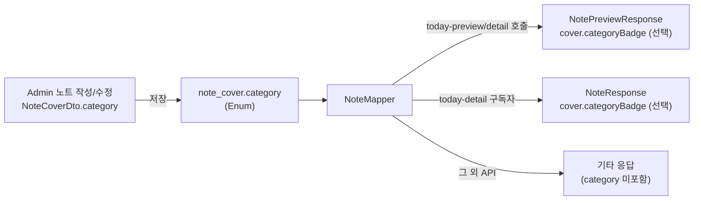

# NoteCoverDto 확장 변경 요약

---

## 1. 변경 배경
- 프론트에서는 커버 정보(제목/티저/대표 이미지)뿐 아니라 **작가 이름과 직함**을 한 번에 참조하고 싶지만, 기존 `NoteCoverDto`는 해당 필드가 없어 별도의 `creator` 객체를 뒤져야 했다.
- 관리자(Admin) 화면에서 노트를 생성/수정할 때도 커버 폼과 작가 메타 정보를 함께 보여주기 위해 같은 DTO를 재활용하고자 했으나 구조가 달라 재사용성이 떨어졌다.
- 이에 `NoteCoverDto`에 `creatorName`, `creatorJobTitle`을 추가해 커버 단위에서 필요한 정보를 묶어 전달하도록 변경했다.

---

## 2. 코드 변경
| 파일 | 주요 수정 |
|------|-----------|
| `src/main/java/com/okebari/artbite/note/dto/note/NoteCoverDto.java` | `creatorName`, `creatorJobTitle` 필드를 추가. (검증은 적용하지 않음, 서버에서 채움) |
| `src/test/java/com/okebari/artbite/note/service/NoteServiceTest.java` | 신규 필드에 맞춰 `NoteCoverDto` 생성자 호출부 갱신. |

> **참고**: 서버에서는 여전히 노트 생성 시 `NoteCoverDto`의 기본 3개 필드(title/teaser/mainImageUrl)만 사용하고, 새로운 필드는 응답/프론트 전용으로 `null` 허용 상태다.

---

## 3. 문서/프론트 타입 반영
| 문서 | 내용 |
|------|------|
| `SYKim_Doc/feature_notes_frontend_plan.md` | `NoteCoverDto` 타입 정의에 `creatorName?`, `creatorJobTitle?` 추가. `NoteCoverResponse`는 더 이상 별도 필드를 선언하지 않고 `NoteCoverDto`를 그대로 확장. |
| `SYKim_Doc/feature_notes_code_draft.md` | Java record 정의, `toCoverDto` 구현, 샘플 요청(`NoteCreateRequest`, `NoteUpdateRequest`) 코드 모두 새로운 필드에 맞춰 업데이트. |

---

## 4. 영향 및 확인 사항
1. **API 요청**: Admin에서 노트 생성/수정 요청을 보낼 때 새 필드 전달은 선택 사항이며, 미입력 시 서버에서 `null`로 처리된다.
2. **응답 구조**: `NoteCoverResponse`는 기존과 동일하게 작가 이름/직함을 포함하지만, 이제 `NoteCoverDto`만으로도 동일 정보를 표현할 수 있어 타입 공유가 수월해진다.
3. **프론트 구현**: 커버 카드/히어로 섹션에서 `cover.creatorName`, `cover.creatorJobTitle`을 바로 사용 가능. (단, 값이 없을 수 있으므로 optional 처리)
4. **추가 검토**: 추후 Admin UI에서 커버 정보와 작가 정보를 동시에 편집할지 여부에 따라 validation 정책을 조정할 수 있다.

---

## 5. 다음 단계
- 기존 프론트 코드에서 `creator` 객체를 통해 이름/직함을 얻고 있었다면, 필요 시 `cover.creatorName`으로 치환할 수 있는지 검토.
- `NoteCoverDto`를 소비하는 다른 문서나 SDK가 있다면 동일 업데이트를 반영.

---

## 6. 카테고리 배지 필드 추가 (2025-02-13)
- **배경**: 무료 상세(`today-preview`)와 유료 상세(`today-detail`)에서만 카테고리 배지를 노출해야 해, 커버 단위로 카테고리 값을 보관하고 선택적인 응답 필드를 내려주도록 확장했다.
- **주요 수정**
  | 파일 | 내용 |
  |------|------|
  | `src/main/java/com/okebari/artbite/note/domain/NoteCategoryType.java` | 카테고리 enum (`FREE`, `PREMIUM`, `GENERAL`) 신설 |
  | `note_cover` 테이블 | `category` 컬럼 추가 (`V8__add_category_to_note_cover.sql`) |
  | `NoteCover` 엔티티 / `NoteCoverDto` | `category` 필드 보유 (요청 시 optional, 기본값 `GENERAL`) |
  | `NoteCoverResponse` | `category` 대신 `CategoryBadgeResponse { type, label }` 필드를 추가해 today-preview/detail에서만 노출 |
  | `NoteMapper` | `toPreviewWithCategory`, `toResponseWithCoverCategory` 등으로 분리해 두 페이지에서만 배지를 세팅 |
- **프론트 영향**
  - Admin 작성/수정 폼(`NoteCoverDto`)에서 `category` 값을 전달하면 DB에 저장되고, today-preview/detail API에선 `cover.categoryBadge`로 바로 랜더링할 수 있다.
  - 기타 API(`archived`, `bookmarks`, `today-cover`)에는 배지가 내려가지 않으므로 기존 UI에는 영향이 없다.
- **카테고리 목록**
  - `MURAL(벽화)`, `EMOTICON(이모티콘)`, `GRAPHIC(그래픽)`, `PRODUCT(제품)`, `FASHION(패션)`, `THREE_D(3D)`, `BRANDING(브랜딩)`, `ILLUSTRATION(일러스트)`, `MEDIA_ART(미디어아트)`, `FURNITURE(가구)`, `THEATER_SIGN(극장 손간판)`, `LANDSCAPE(조경)`, `ALBUM_ARTWORK(음반 아트워크)`, `VISUAL_DIRECTING(비주얼 디렉팅)`, `NONE(카테고리 없음)`

### 6.1 카테고리 노출 흐름

1. **입력**: Admin이 `NoteCoverDto.category`에 위 Enum 중 하나를 선택(미선택 시 `NONE`).
2. **저장**: `NoteCover` 엔티티와 `note_cover.category` 컬럼에 그대로 기록.
3. **매퍼 분기**  
   - `NoteMapper.toPreviewWithCategory` / `toResponseWithCoverCategory`: today-preview / today-detail에서만 `CategoryBadgeResponse(type, label)`을 생성해 `cover.categoryBadge`에 포함.  
   - `NoteMapper.toPreview`, `toResponse`, `toCoverResponse` 등 다른 매퍼 경로는 배지를 채우지 않음.
4. **프론트 노출**  
   - 무료 상세(today-preview)와 유료 상세(today-detail)에서만 `cover.categoryBadge`가 렌더링된다.  
   - `type` 값은 Enum 이름(MURAL 등), `label`은 한글 라벨(벽화 등).
