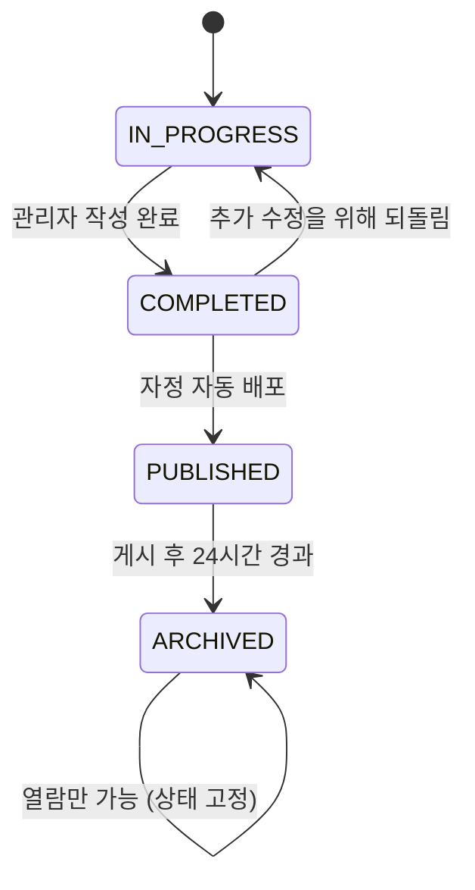
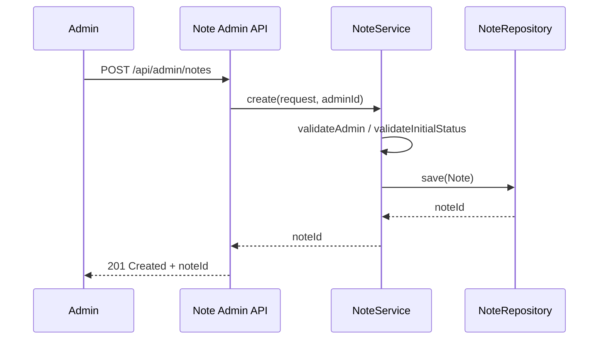
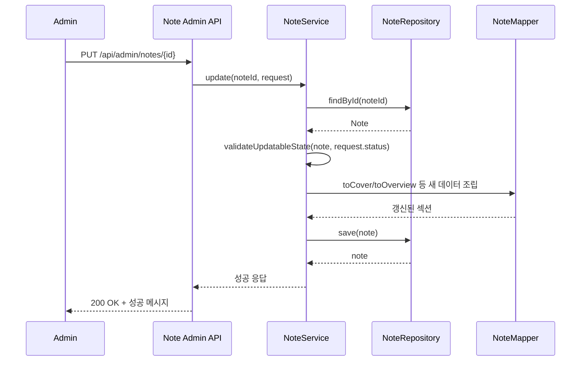
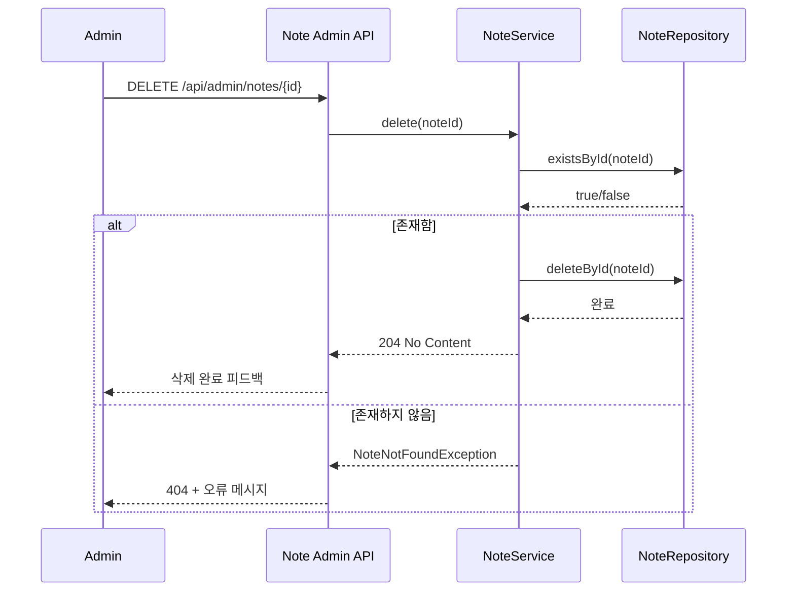
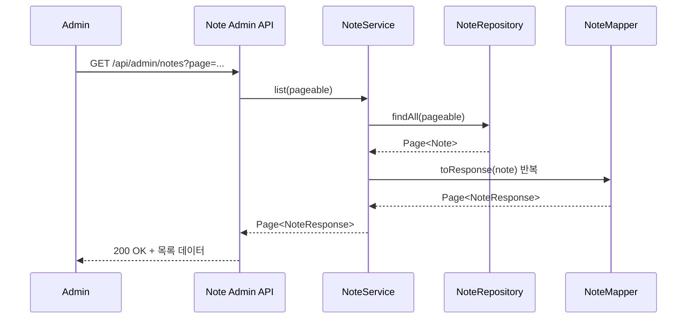
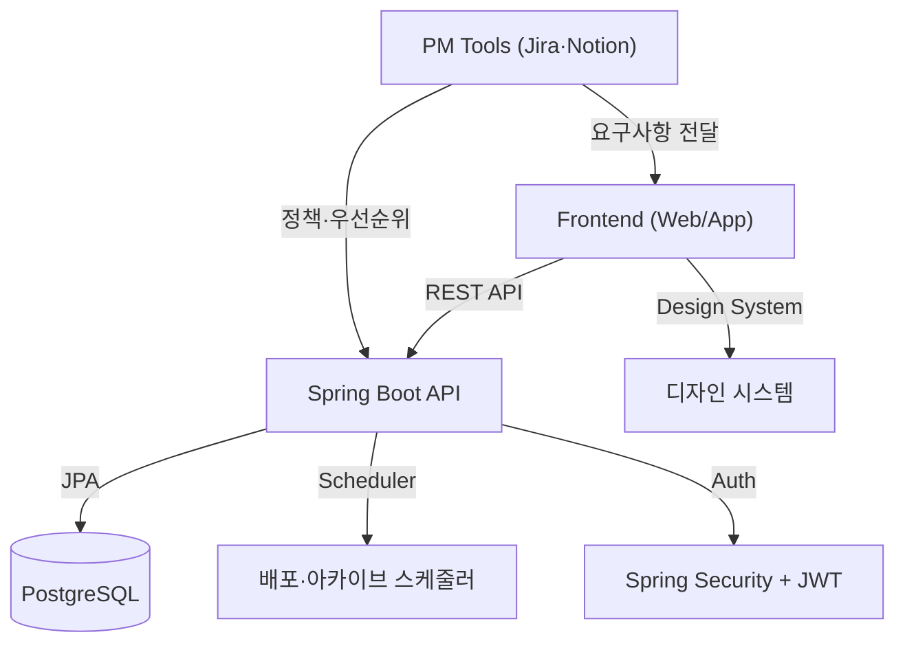

[#3] Presentation Deck: Note CRUD 설계 및 구현 개요

---

## 1. 시스템 개요
- **목표**: ADMIN 롤이 작업 노트를 생성/관리하고, 사용자에게는 상태에 맞춘 열람 경험을 제공.
- **핵심 개념**: `Note` 애그리거트가 커버/프로세스/질문 등 하위 섹션을 모두 포함, 상태 전이에 따라 공개 범위가 달라짐.
- **아키텍처**: Spring Boot 기반, JPA로 도메인 모델 매핑, JWT 인증 + ROLE 기반 접근 제어.

---

## 2. 도메인 모델 구성
- **루트 애그리거트 `Note`** (`src/main/java/com/okebari/artbite/note/domain/Note.java:1`)
  - 상태(`NoteStatus`): `IN_PROGRESS → COMPLETED → PUBLISHED → ARCHIVED`.
  - 연관 엔티티: `NoteCover`, `NoteOverview`, `NoteRetrospect`, `NoteProcess`(List), `NoteQuestion`(+ `NoteAnswer`), `Creator`.
  - 주요 동작: `assignCover`, `replaceProcesses`, `assignQuestion`, `markPublished`, `markArchived`, `revertToInProgress`.
- **상세 섹션 역할**
  - Cover: 제목/티저/대표 이미지 (썸네일 및 홈 노출 담당).
  - Overview & Retrospect: 본문 텍스트 블록.
  - Process: 포지션 기반으로 Process 1/2 공유 스키마 저장.
  - Question & Answer: ADMIN 질문 + USER 응답; 응답은 선택 입력 가능.

---

## 3. 레이어드 아키텍처
1. **Controller**
   - `NoteAdminController` (`src/main/java/com/okebari/artbite/note/controller/NoteAdminController.java:1`): ADMIN CRUD 엔드포인트.
   - `NoteQueryController`, `NoteAnswerController`, `NoteBookmarkController`: 사용자 열람/참여 기능 분리.
2. **Service**
   - `NoteService` (`src/main/java/com/okebari/artbite/note/service/NoteService.java:1`): ADMIN CRUD 비즈니스 로직, 권한 검증 및 상태 규칙 확인.
   - `NoteQueryService`: 공개/아카이브 노트 조회, 구독자 확인(`SubscriptionService`).
3. **Mapper**
   - `NoteMapper` (`src/main/java/com/okebari/artbite/note/mapper/NoteMapper.java:1`): 복합 DTO ↔ 엔티티 변환, 하위 섹션 전부 조립.
4. **Repository**
   - `NoteRepository` (`src/main/java/com/okebari/artbite/note/repository/NoteRepository.java:1`): 상태 기반 조회, 자동 배포/아카이브 스케줄러용 쿼리 제공.

---

## 4. CRUD 플로우 상세
### 4.1 Create
1. `POST /api/admin/notes` (ADMIN)
2. `NoteService.create` 절차
   - ADMIN 권한 확인 (`validateAdmin`).
   - 초기 상태 검증 (`IN_PROGRESS` 또는 `COMPLETED`만 허용).
   - `NoteMapper.toEntity`로 커버/개요/프로세스/질문을 엔티티화.
   - `resolveCreator`로 작가 FK 유효성 확인.
   - 저장 후 생성된 `noteId` 반환.

### 4.2 Read
- 단건 조회: `GET /api/admin/notes/{id}` → `NoteService.get`, 없는 경우 `NoteNotFoundException`.
- 목록 조회: `GET /api/admin/notes` → 페이지네이션, 향후 필터 확장 가능.

### 4.3 Update
1. `PUT /api/admin/notes/{id}` (ADMIN)
2. 주요 로직
   - 현재 상태 + 목표 상태 조합 검증 (`validateUpdatableState`): PUBLISHED/ARCHIVED 수정 금지, COMPLETED 재수정 시 IN_PROGRESS 요구.
   - `NoteMapper`를 통해 하위 섹션 전체 교체 (커버, 개요, 회고, 프로세스, 질문).
   - 외부 링크, 태그, 작가 참조 갱신.

### 4.4 Delete
- `DELETE /api/admin/notes/{id}` → 존재 확인 후 삭제. 없으면 `NoteNotFoundException`.

---

## 5. 상태 전이 & 스케줄링
- **작성 단계**
  - IN_PROGRESS: 자동 저장/수정 가능.
  - COMPLETED: 내용 확정, 배포 후보.
- **배포 단계**
  - 매일 자정 스케줄러가 `NoteRepository.findCompletedOrderByUpdatedAtAsc()`로 가장 오래된 COMPLETED 노트를 PUBLISHED로 전환.
  - `SubscriptionService` 연동으로 ACTIVE 멤버십 사용자만 본문 열람.
- **아카이브**
  - PUBLISHED 후 24시간 경과 시 `findPublishedBefore()` 조회 → ARCHIVED 전환.
  - ARCHIVED는 홈 비노출, 지난 노트 목록에서만 열람; 유료 구독자만 상세 접근 가능.

---

## 6. 유효성 & 예외 처리
- `UserRole.ADMIN` 강제 (`validateAdmin`).
- 상태 전이 제약 (`NoteInvalidStatusException`).
- Creator FK 존재 여부 (`CreatorNotFoundException`).
- 미존재 노트 접근 (`NoteNotFoundException`).
- 접근 권한 위반 시 `NoteAccessDeniedException`.

---

## 7. DTO & 응답 구조
- `NoteCreateRequest` / `NoteUpdateRequest`: 하위 섹션 DTO (cover, overview, processes, question, externalLink).
- `NoteResponse`: 전체 노트 상세 + `NoteAnswerResponse`.
- `NotePreviewResponse`: 무료 미리보기용 축약 데이터.
- `ArchivedNoteSummaryResponse`: 지난 노트 목록용 요약 (제목/이미지/태그).

---

## 8. 데이터 접근 전략
- **JPA 연관관계**
  - `CascadeType.ALL + orphanRemoval=true` 조합으로 하위 섹션을 루트에서 일괄 관리.
  - `NoteProcess`는 position 복합키(`NoteProcessId`)로 1개의 테이블에 2개의 프로세스를 저장.
- **쿼리 최적화**
  - `@Query` 활용해 상태별 컬렉션 조회 (드래프트, 게시, 아카이브).
  - 검색 기능은 제목/태그/작가명에 대한 부분 일치.

---

## 9. 권한 & 접근 제어
- ADMIN 전용 API는 `@PreAuthorize("hasRole('ADMIN')")`.
- 사용자 열람 API는 `SubscriptionService`를 통해 ACTIVE 멤버십만 전체 노트 접근 허용.
- USER 롤은 `NoteAnswerController`에서 답변 작성/수정 가능(선택 사항).

---

## 10. 확장 고려 사항
- 배포 스케줄러/아카이브 로직은 `note.scheduler` 패키지로 분리 (향후 Quartz/Batch 교체 가능).
- 멤버십 로직 교체 시 `SubscriptionService` DI만 변경하면 노트 서비스 영향 최소화.
- 이미지/파일 업로드 연동 시 Cover DTO에 업로드된 URL 주입 구조 그대로 재사용 가능.

---

## 11. 발표용 핵심 메시지 요약
1. **도메인 일관성**: Note 애그리거트가 모든 하위 섹션을 소유해 트랜잭션 단위 관리.
2. **상태 기반 UX**: 상태 전이에 따라 노출 경험과 권한이 자동으로 달라진다.
3. **확장 가능 구조**: 인터페이스 기반 구독 검증, 스케줄러 분리, DTO 매퍼로 API 진화를 대비.

---

## 12. 디자인·PM용 시각 자료 제안

### 12.1 상태 전이 다이어그램 (Mermaid 예시)

- 슬라이드에 그대로 붙이면 상태 흐름을 직관적으로 설명 가능.

### 12.2 관리자/사용자 여정 맵
| 단계 | ADMIN | USER (구독자) | USER (비구독자) |
|------|-------|---------------|-----------------|
| 작성 | 노트 초안 작성(IN_PROGRESS) | - | - |
| 검수 | 내용 확정(COMPLETED) | - | - |
| 배포 | 자정 자동 배포(PUBLISHED) | 새 노트 전체 열람 | 미리보기(100자)만 노출 |
| 24시간 후 | 자동 아카이브(ARCHIVED) | 지난 노트 목록에서 열람 가능 | 지난 노트 목록은 리스트만, 상세 차단 |

### 12.3 인터랙션 순서도 (Mermaid 예시)

- 발표 자료에 삽입해 "한 장"으로 처리 흐름 공유 가능.

#### Update 인터랙션 순서도


#### Delete 인터랙션 순서도


#### Read 인터랙션 순서도


### 12.4 홈 화면 리마인더 UX (디자인 가이드)
1. 자정 이후 첫 방문 시 상단 배너/팝업으로 랜덤 작업 노트 노출.
2. 닫기 버튼 → "정말 닫을까요?" 확인 모달 (프론트 구현).
3. 최종 닫기 선택 → 백엔드에 `POST /reminders/{id}/dismiss` 요청, 당일 재노출 차단.
4. 디자인팀에서는 배경이미지/요약문구/닫기 CTA 스타일 정의, PM은 노출 우선순위 룰 관리.

- 위 자료는 Figma/슬라이드에 바로 적용 가능하며, 필요 시 Mermaid 코드를 사용해 시각 다이어그램 생성 후 이미지로 내보내면 됩니다.

**기술 스택을 이해하기 위한 추가 설명**
- **프론트엔드**: React 기반(가정)에서 모달/팝업을 담당하며, REST API 호출(`fetch` 또는 Axios)로 백엔드와 상태를 주고받습니다. 디자인팀이 전달한 레이아웃/모션을 컴포넌트로 구현합니다.
- **백엔드**: Spring Boot + JPA. 리마인더 상태는 별도 테이블(예: `reminder_dismissals`)에 사용자·날짜 기준으로 저장하여 하루 동안 재노출을 막습니다. 스케줄러는 `Spring @Scheduled` 또는 배치 모듈에서 KST 자정에 실행됩니다.
- **인증/권한**: JWT 기반 인증 토큰을 `Authorization` 헤더로 전달, Spring Security에서 ROLE(USER/ADMIN)을 판별해 API 접근을 제어합니다.
- **배포/운영**: CI/CD 파이프라인(GitHub Actions 등)으로 테스트/Checkstyle 후 배포. 리마인더/홈 화면 변경 사항은 API 명세와 Figma 디자인 파일에 동기화합니다.

**시각 자료 제안**
- Mermaid로 기술 스택 개요 흐름을 추가하면 비개발자도 전체 구조를 빠르게 이해할 수 있습니다.

- 발표 시 이 다이어그램을 슬라이드에 삽입하여 “디자인 → 프론트 → 백엔드 → 데이터베이스” 흐름을 한눈에 보여주는 것을 권장합니다.

### 12.5 CRUD 상세 플로우 (Mermaid Flowchart)
```mermaid
flowchart LR
    subgraph AdminApp[관리자 화면]
        A1[노트 입력 폼] --> A2{저장 버튼 클릭?}
        A2 -- 예 --> A3[REST 요청 전송]
    end
    A3 -->|POST /api/admin/notes| C1[NoteAdminController]
    C1 -->|DTO 검증| S1[NoteService.create]
    S1 -->|권한·초기 상태 검증| S2[비즈니스 로직]
    S2 -->|엔티티 변환| M1[NoteMapper.toEntity]
    M1 -->|save| R1[NoteRepository]
    R1 --> DB[(notes_head 외 테이블)]
    R1 -->|noteId 반환| S1 --> C1 -->|201 + noteId| AdminApp

    subgraph UpdateFlow[수정 흐름]
        U1[노트 상세 화면] --> U2{저장}
        U2 -- 예 --> U3[PUT /api/admin/notes/{id}]
    end
    U3 --> C2[NoteAdminController]
    C2 --> S3[NoteService.update]
    S3 -->|상태 전환 규칙 확인| S4[NoteMapper로 하위 섹션 갱신]
    S4 --> R2[NoteRepository.save]
    R2 --> DB

    subgraph DeleteFlow[삭제 흐름]
        D1[노트 상세 화면] --> D2{삭제}
        D2 -- 예 --> D3[DELETE /api/admin/notes/{id}]
    end
    D3 --> C3[NoteAdminController]
    C3 --> S5[NoteService.delete]
    S5 -->|existsById 확인| R3[NoteRepository]
    R3 -->|deleteById| DB

    subgraph ReadFlow[조회 흐름]
        RQ1[관리자 목록 요청] -->|GET /api/admin/notes| C4[NoteAdminController]
        C4 --> S6[NoteService.list]
        S6 --> R4[NoteRepository.findAll]
        R4 --> DB
        R4 -->|Page<Note>| S6 -->|NoteMapper.toResponse| C4 --> RQ1
    end
```
- **Create**: 입력 폼 → `POST /api/admin/notes` → Service에서 ADMIN 권한/초기 상태 검증 → Mapper로 엔티티 생성 → Repository `save`.
- **Update**: `PUT /api/admin/notes/{id}` → 상태 전환 규칙 검증 → 하위 섹션 전체 갱신 → `save`.
- **Delete**: `DELETE /api/admin/notes/{id}` → 존재 여부 확인 후 `deleteById`.
- **Read**: 목록/단건 조회가 모두 `NoteRepository`와 `NoteMapper`를 통해 DTO로 조합됨.
- 프론트엔드는 각 응답 결과에 따라 토스트/모달 등 피드백을 노출하고, 실패 시 API에서 내려주는 에러 메시지를 그대로 안내 문구로 사용하면 됩니다.

### 12.6 디자인팀용 CRUD 요약
- **Create (노트 작성)**
  - ADMIN이 입력 폼에서 제목/이미지/본문을 작성하고 저장.
  - 서버가 글의 상태(`IN_PROGRESS` 또는 `COMPLETED`)를 검증 후 저장.
  - 성공 시 “게시 준비됨” 토스트/완료 모달 노출 → 디자인 팀은 저장 완료 상태와 오류 상태(권한 없음, 필수 입력 누락)에 대한 UI를 준비.
- **Read (노트 확인)**
  - 관리자 목록/상세 화면에서 최신 노트를 불러옴.
  - 커버/본문/프로세스/질문 등 모든 섹션이 DTO로 전달 → 디자인에서 정의한 카드/상세 레이아웃 그대로 재현.
  - 검색/필터 추가 시에도 동일한 응답 구조를 사용 가능.
- **Update (노트 수정)**
  - 작성 완료 후에도 `IN_PROGRESS`로 되돌리면 재편집 가능, `PUBLISHED/ARCHIVED`는 잠금 처리.
  - 수정 저장 시 기존 커버/본문을 새 값으로 통째로 교체 → 디자인은 “수정 완료” 피드백과 잠금 상태 문구를 명확히 표기.
- **Delete (노트 삭제)**
  - 삭제 버튼 누르면 서버가 존재 여부 확인 후 제거.
  - 성공 시 목록에서 즉시 제거, 디자인은 “삭제되었습니다” 토스트 + Undo가 필요하면 프런트에서 별도로 구현.
  - 삭제 불가 상황(이미 게시/아카이브 등)에 대비한 경고 메시지 표준안을 준비.
