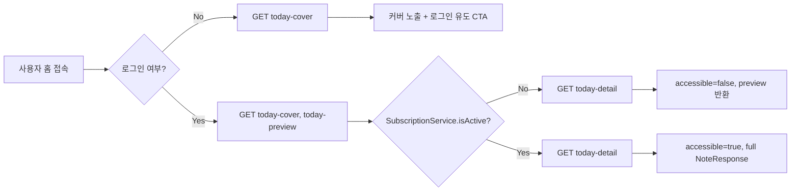
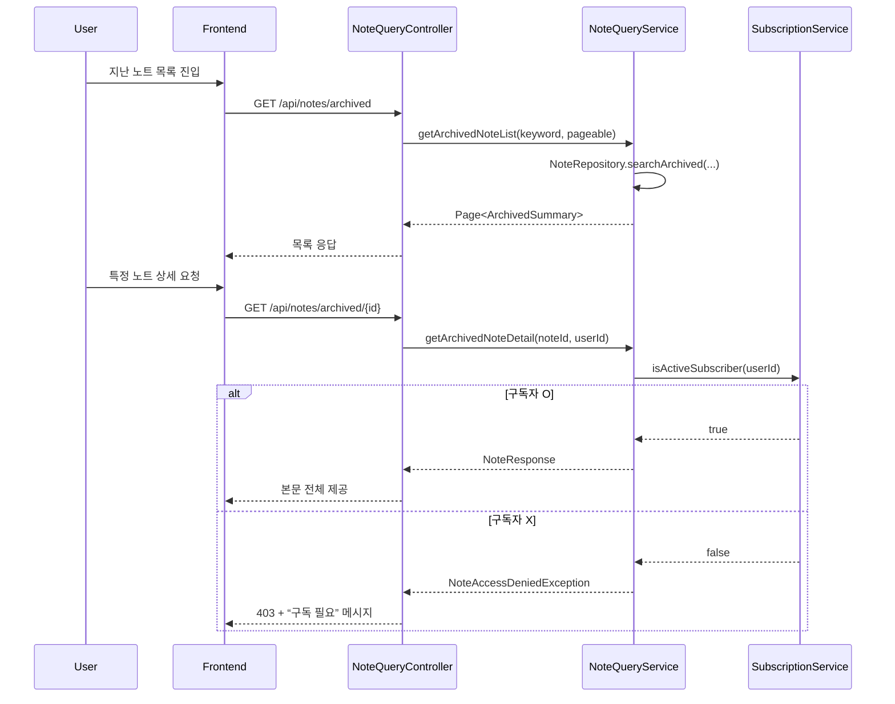

[#3] Presentation Deck: 노트 홈 & 사용자별 조회 흐름

---

## 1. 홈 화면 개요
- **주요 목표**
  - 매일 자정에 게시(PUBLISHED)된 노트를 홈 상단에 노출.
  - 사용자 타입(게스트, 일반 회원, 유료 구독자, ADMIN)에 따라 노출 범위를 차등 제공.
- **핵심 데이터 소스**
  - `NoteRepository.findFirstByStatusAndPublishedAtBetween(...)` (KST 기준 자정~자정 범위)
  - `NoteQueryService.getTodayCover / getTodayPreview / getTodayPublishedDetail`
  - `SubscriptionService` (ACTIVE 멤버십 여부)

---

## 2. 홈 화면 API 요약
| 기능 | 엔드포인트 | 인증 | 설명 | 주요 응답 |
|------|------------|------|------|-----------|
| 오늘의 커버 | `GET /api/notes/published/today-cover` | 없음 | 온보딩 이후 첫 화면용 썸네일 | `NoteCoverResponse` (제목/티저/대표이미지/작성자명) |
| 오늘의 미리보기 | `GET /api/notes/published/today-preview` | USER/ADMIN | 100자 제한 개요, CTA 버튼 안내 | `NotePreviewResponse` (cover + overview.bodyText<=100자) |
| 오늘의 전체 보기 | `GET /api/notes/published/today-detail` | USER/ADMIN | 구독 여부에 따라 본문 또는 미리보기 분기 | `TodayPublishedResponse` (`accessible`, `full`, `preview`) |
| 지난 노트 목록 | `GET /api/notes/archived` | USER/ADMIN | 아카이브 목록 + 검색어 | `Page<ArchivedNoteSummaryResponse>` |
| 지난 노트 상세 | `GET /api/notes/archived/{id}` | USER/ADMIN | 구독자만 본문 열람 가능 | `NoteResponse` |

---

## 3. 사용자 타입별 노출 정책

### 3.1 게스트(비로그인)
- **노출 범위**: 홈 상단 커버 슬라이드만 (`today-cover`).
- **제한**: 미리보기/상세/지난 노트 API 접근 불가(401).
- **디자인 가이드**: "로그인 후 전체 미리보기 이용 가능" 배너 연결.

### 3.2 일반 회원 (USER), 멤버십 없음
- **미리보기**: `today-preview` 응답 사용.
  - `NotePreviewResponse.overview.bodyText`는 `NoteMapper.toPreview`에서 100자 제한.
- **전체 보기 CTA**: `today-detail` 호출 시 `TodayPublishedResponse.accessible=false` 및 `preview` 포함.
  - 프론트는 “구독하면 전체 내용을 볼 수 있습니다” 안내 모달 표시.
- **지난 노트**: 목록 조회는 가능하나 상세(`archived/{id}`)에서 `NoteAccessDeniedException`.

### 3.3 유료 구독자 (ACTIVE 멤버십)
- **전체 노출**: `today-detail`에서 `accessible=true` + `full` (= `NoteResponse`).
- **지난 노트 상세**: `archived/{id}`에서 전체 본문 제공.
- **구독 판별 로직**: `MembershipSubscriptionService.isActiveSubscriber(userId)` (KST 만료 체크).

### 3.4 ADMIN
- USER 권한과 동일하게 조회 가능 + 별도 ADMIN용 CRUD 화면(`NoteAdminController`) 접근 가능.
- 홈 화면에서는 유료 구독자와 동일한 데이터 노출.

---

## 4. 홈 진입 시나리오 (Mermaid Flow)

---

## 5. 오늘의 노트 데이터 구성
| 필드 | 설명 | 출처 |
|------|------|------|
| `cover.title`, `cover.teaser`, `cover.mainImageUrl` | 홈 배너 텍스트/이미지 | `NoteCover` |
| `overview.bodyText(<=100자)` | 100자 요약 | `NoteOverview` → `NoteMapper.toPreview` |
| `creatorName`, `creatorJobTitle` | 작성자 라벨 | `NoteCreator` |
| `externalLink` (상세 전용) | 추가 리소스 URL | `Note.sourceUrl` (`today-preview`에는 미포함) |
| `cover.publishedDate` | "오늘 게시 시간" 표기 | `Note.publishedAt` |

---

## 6. 사용자 액션별 응답 패턴
| 액션 | 평균 UI 동작 | 백엔드 응답 | 다음 UX |
|------|--------------|-------------|----------|
| “전체 보기” 클릭 (비구독자) | 구독 안내 팝업 | `accessible=false`, `preview` 포함 | “구독하기” 버튼 노출 |
| “지난 노트 보기” 진입 (비구독자) | 리스트까지 접근 가능 | 상세 호출시 403 예외 → 커스텀 메시지 | “멤버십 가입” CTA |
| “닫기”로 팝업 확정 (리마인더) | 프론트에서 2차 확인 → dismiss API 호출 제안 | 향후 구현: `POST /reminders/{id}/dismiss` | 당일 재노출 차단 |
| 자정 이후 재접속 | 스케줄러가 COMPLETED → PUBLISHED 처리 | `findTodayPublishedNote()` KST 기준 재계산 | 새로운 노트로 커버/미리보기 치환 |

---

## 7. 지난 노트 사용자 흐름 (Mermaid Sequence)

---

## 8. 디자인 & PM 확인 포인트
1. **상태별 문구**: Accessible=false일 때 사용될 안내 문구/CTA 문구 확정 필요.
2. **이미지 규격**: `NoteCover.mainImageUrl`로 내려주는 이미지 비율/최소 해상도 가이드라인 지정.
3. **리마인더 팝업**: 닫기 후 당일 재노출 방지 플래그를 프론트에서 `dismiss` API로 전달하는 구조 확정.
4. **검색 UX**: 지난 노트 검색 필드에서 제목/태그/작가명을 동시에 찾음 → 자동완성/필터 여부 PM 확정.
5. **시간 표기**: `publishedAt`, `archivedAt`은 KST 기준으로 프론트에서 “오늘 자정 게시” 등 자연어 변환 필요.

---

## 9. 요약 슬라이드 키 메시지
1. **하루 1건 배포**: 자정마다 홈 화면 데이터가 교체되며, 구독 여부에 따라 미리보기/전체 뷰가 결정됨.
2. **역할 기반 UX**: 게스트 → 커버만, 일반 회원 → 미리보기, 구독자 → 전체 노트, ADMIN → CRUD 가능.
3. **확인/구독 CTA 흐름**: 비구독자는 모든 여정에서 구독 전환 유도 메시지를 받도록 응답 구조 설계 완료.
