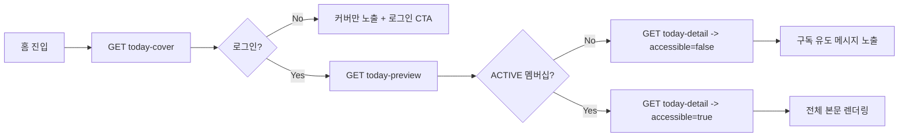
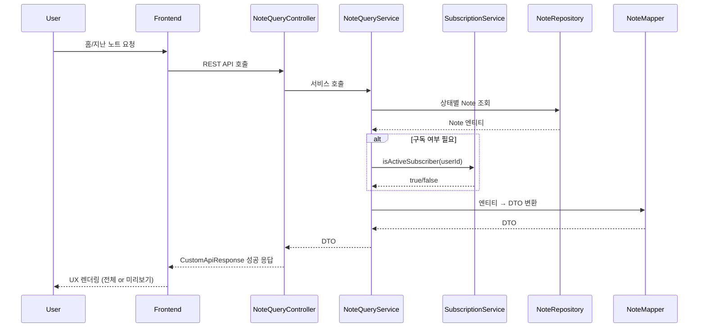

[#3] Presentation Deck: 작품 노트 조회 아키텍처

---

## 1. 목표와 맥락
- **목표**: 홈 화면과 지난 노트 영역에서 사용자 유형(게스트/회원/구독자/ADMIN)에 맞게 노트 데이터를 제공.
- **핵심 포인트**: 하루 1건 배포, KST 자정으로 상태 전환, 멤버십 구독 여부에 따른 접근 제어, UI/UX 팀과의 협업.
- **주요 컴포넌트**: `NoteQueryController`, `NoteQueryService`, `NoteRepository`, `SubscriptionService`, `NoteMapper`.

---

## 2. 도메인 & 상태 개요
- **NoteStatus 흐름**: `IN_PROGRESS → COMPLETED → PUBLISHED → ARCHIVED`.
- 조회 시 관여하는 상태
  - `PUBLISHED`: 홈/메인 화면에서 오늘의 노트로 노출.
  - `ARCHIVED`: 지난 노트 목록/상세에서 노출, 유료 구독자만 전문 열람 가능.
- **연관 데이터**
  - `NoteCover`: 제목, 티저, 대표 이미지 → 홈 배너/썸네일.
  - `NoteOverview`: 미리보기 100자 추출.
  - `Creator`: 작가 이름/직함 → 카드 하단 라벨.
  - `NoteQuestion`/`NoteAnswer`: 상세 페이지 하단 Q&A 영역.

---

## 3. 레이어드 구성
| 레이어 | 역할 | 주요 클래스 |
|--------|------|-------------|
| Controller | REST API 응답 구조 정의, 인증 어노테이션 | `NoteQueryController` |
| Service | 비즈니스 규칙·멤버십 판별·예외 처리 | `NoteQueryService`, `SubscriptionService` |
| Mapper | 엔티티 ↔ DTO 변환, 미리보기 100자 생성 | `NoteMapper` |
| Repository | 상태 기반 조회 쿼리 | `NoteRepository` |

---

## 4. 주요 API 맵
| Endpoint | 설명 | 접근 권한 | 응답 DTO |
|----------|------|-----------|-----------|
| `GET /api/notes/published/today-cover` | 오늘 노트 커버 | 전체 (비로그인 포함) | `NoteCoverResponse` |
| `GET /api/notes/published/today-preview` | 100자 미리보기 | USER/ADMIN | `NotePreviewResponse` |
| `GET /api/notes/published/today-detail` | 전체 상세/미리보기 분기 | USER/ADMIN | `TodayPublishedResponse` |
| `GET /api/notes/archived` | 지난 노트 목록 검색 | USER/ADMIN | `Page<ArchivedNoteSummaryResponse>` |
| `GET /api/notes/archived/{id}` | 지난 노트 상세 (구독자만) | USER/ADMIN | `NoteResponse` |

- **구독 판별**: `SubscriptionService.isActiveSubscriber(userId)` → `MembershipSubscriptionService`가 ACTIVE 멤버십/만료 시간을 확인.

---

## 5. 홈 화면 조회 플로우 (Mermaid)

---

## 6. 서비스 로직 하이라이트
- `NoteQueryService.getTodayCover()`: `findTodayPublishedNote()`로 Note 조회 → `NoteMapper.toCoverResponse`.
- `NoteQueryService.getTodayPublishedDetail(userId)`:
  1. 오늘 노트 조회.
  2. `subscriptionService.isActiveSubscriber(userId)` 호출.
  3. `true` → `NoteMapper.toResponse`, `false` → `NoteMapper.toPreview`.
- `NoteQueryService.getArchivedNoteList(keyword, pageable)`:
  - 키워드 유무로 `findAllArchived` 또는 `searchArchived`.
  - 결과를 `noteMapper.toArchivedSummary`로 변환.
- `NoteQueryService.getArchivedNoteDetail(noteId, userId)`:
  - 구독자 확인 → 미구독자면 `NoteAccessDeniedException`.
  - 노트가 ARCHIVED 상태인지 검증 → 아니면 `NoteInvalidStatusException`.

---

## 7. 데이터 흐름 다이어그램 (Mermaid)

---

## 8. UX 팀 협업 포인트
1. **미리보기 길이**: 100자 제한(`OVERVIEW_PREVIEW_LIMIT`) → 디자인팀 문구 길이 가이드 필요.
2. **액션 CTA**: `accessible=false`일 때 노출할 구독 유도 문구/버튼 텍스트 확정.
3. **시간 라벨링**: `publishedAt`, `archivedAt`은 KST 기준 → 프론트에서 “오늘 자정 게시”, “어제 게시” 등 자연어 처리.
4. **에러 메시지 맵핑**: `NoteAccessDeniedException`, `NoteNotFoundException` 등 서버 메시지를 사용자 안내 문구로 변환하는 매핑 테이블 공유.

---

## 9. 테스트 & 모니터링
- **단위 테스트**: `NoteQueryService`에서 구독 여부에 따른 분기, 아카이브 상태 검증 케이스.
- **통합 테스트**: 멤버십 ACTIVE/만료 조합, 오늘 노트가 없을 때 예외 반환 확인.
- **모니터링**: 홈 화면 200/403 비율, `NoteNotFoundException` 발생 시 경보(자정 배포 실패 확인용).

---

## 10. 발표용 핵심 요약
1. **역할 기반 노출**: 사용자 타입에 따라 데이터 흐름과 응답 구조가 명확히 분리.
2. **멤버십 연동**: `SubscriptionService` 한 곳에서 구독 여부를 판별해 서비스 전반에 재사용.
3. **UX 일관성**: Mapper와 DTO가 커버/미리보기/상세 데이터를 일관되게 조립, 디자인 의도 유지.

---

## 11. 디자인팀용 요약
- **홈 커버/배너**
  - `today-cover` API에서 제목·티저·대표 이미지를 내려주므로, 디자인 시안과 동일한 레이아웃으로 바로 사용 가능.
  - 게스트(비로그인)는 커버만 보므로 “로그인하면 더 볼 수 있어요” CTA 배치 권장.
- **미리보기 영역**
  - `today-preview` 응답은 개요 텍스트 100자 제한 → 디자인에서 설정한 최대 글자 수와 일치하도록 폰트/줄 수 조정.
  - `archived/{id}`에서도 `accessible=false + preview`가 내려오면 동일한 프리뷰 UI와 구독 유도 버튼(UI Kit 기준)을 사용한다.
- **전체 보기(구독자)**
  - `TodayPublishedResponse.full`이 `NoteResponse` 전체 구조: 커버, 개요, 프로세스, 질문/답변, 작가 정보까지 포함 → 상세 페이지 모듈을 그대로 조립.
  - 구독자 전용 영역에는 ‘유료 배지’나 강조 라벨을 추가해 차별화할 수 있음.
- **지난 노트 목록/상세**
  - 아카이브 목록 응답(`ArchivedNoteSummaryResponse`)에 썸네일/작가명/게시일/태그가 포함되어 있으므로 카드 디자인에 그대로 매핑.
  - 상세 API(`archived/{id}`)의 `accessible` 값을 보고 프리뷰/전체 보기 UI를 분기한다. 비구독자는 프리뷰 화면에서 “멤버십 가입 안내” CTA를 노출한다.
- **시간/상태 표시**
  - `publishedAt`, `archivedAt`을 KST 기준으로 표시하므로, “오늘 게시”, “어제 게시” 등 자연어 처리 로직을 프론트에서 정의.
  - 상태 뱃지(IN_PROGRESS/COMPLETED 등)는 관리자 화면에서만 필요하며, 사용자 화면은 PUBLISHED/ARCHIVED 기반으로 노출.
