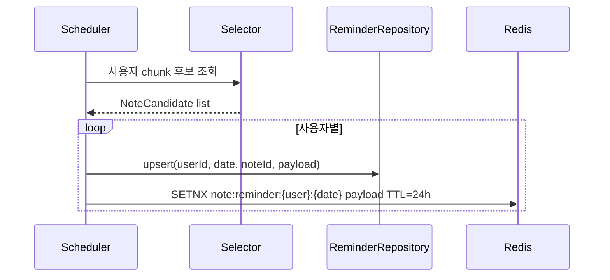
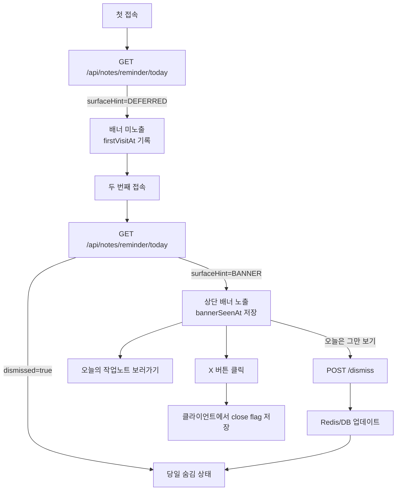
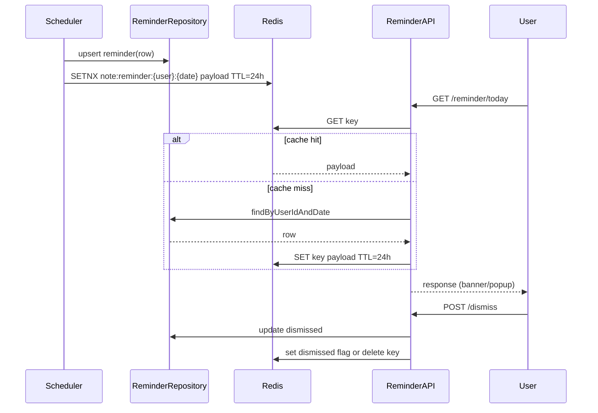
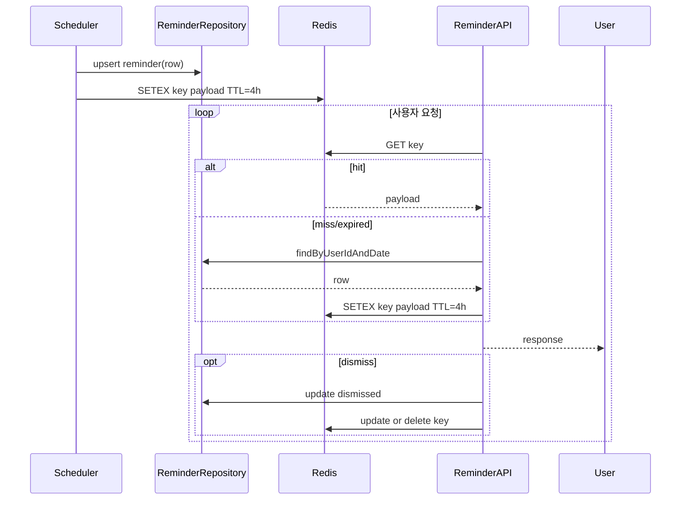

# Presentation: Daily Reminder Note Digest

---

## 1. 목적과 배경
- **핵심 목표**: 북마크하거나 질문에 답했던 과거 작업노트를 하루 한 번 랜덤으로 다시 노출해 재참여를 유도한다.
- **사용자 가치**
  - 하루 한 번 “잊고 있던 작업노트” 배너를 *두 번째 접속부터* 노출해 흐름을 방해하지 않는다.
  - 당일에는 앱 재접속 시에도 동일한 콘텐츠가 유지되어 집중도를 높임.
  - “오늘은 그만 보기”로 제어권을 제공, 다음날 자정에 자동 리셋.
- **업데이트 주기**: 00:00 (Asia/Seoul) 기준으로 사용자별 하나의 노트를 선정하여 24시간 캐싱.

---

## 2. 데일리 타임라인
| 시점 | 시스템 동작 | 노출/상태 |
|------|-------------|-----------|
| 00:00 | `NoteReminderScheduler` 실행, 사용자별 후보군에서 랜덤 1건 선택 후 DB upsert + Redis 워밍 | `note_reminder_digest` 갱신 |
| 첫 접속 | `GET /api/notes/reminder/today` 호출, `surfaceHint=DEFERRED`, `firstVisitAt` 기록, 배너 노출 안 함 | 조용히 상태만 세팅 |
| 두 번째 접속 | 동일 API 호출, `firstVisitAt` 존재 & `bannerSeenAt` 미설정 → `surfaceHint=BANNER`, `bannerSeenAt` 기록 | 상단 배너 최초 노출 (X 버튼 포함) |
| 이후 접속 | `bannerSeenAt` 존재 & `dismissed=false`면 계속 `surfaceHint=BANNER` 반환, `bannerClosed` 로컬 상태에 따라 UI 결정 | 배너 유지(클라이언트에서 close 상태 기억) |
| 배너 X 클릭 | 클라이언트에서 close flag 저장(필요 시 `POST /banner-close`로 `bannerClosedAt` 기록) | 현재 세션/탭에서만 숨김 |
| “오늘은 그만 보기” 클릭 | `POST /dismiss` → `dismissed=true`, Redis 동기화 | 당일 노출 중지 |
| 24h 경과 | 다음 자정 배치가 새 노트를 뽑으면서 상태 초기화 | 새로운 콘텐츠 |

---

## 3. 시스템 구성 및 책임
| 컴포넌트 | 역할 | 세부 내용 |
|----------|------|-----------|
| `NoteReminderScheduler` | 매일 00:00에 배치 실행, 후보군 chunk 처리 | `@Scheduled(cron = "0 0 0 * * *", zone = "Asia/Seoul")` + ShedLock |
| `NoteReminderSelector` | 북마크/답변 데이터로 후보 리스트 구성 및 랜덤 샘플링 | 가중치 적용, 최근 활동 우선 |
| `NoteReminderService` | 조회/숨김 비즈니스 로직, 캐시 동기화 | firstVisit·bannerSeen·dismiss 상태 관리 |
| `NoteReminderController` | `GET /today`, `POST /dismiss` API 제공 | JWT 인증 |
| `NoteReminderRepository` | `note_reminder_digest` JPA 접근 | `findByUserIdAndReminderDate` |
| Redis 캐시 | 당일 노트를 TTL 24h로 저장 | 키 `note:reminder:{userId}:{yyyymmdd}` |
| Event Listener | 노트 삭제·비공개 시 캐시 무효화 | `NoteEventListener` 확장 |

---

## 4. 디렉토리 구조 & 수정 범위
```
src/main/java/com/okebari/artbite/note
├── controller
│   ├── NoteReminderController.java (+)
│   └── NoteBookmarkController.java (기존)
├── domain
│   └── NoteReminder.java (+)
├── dto
│   ├── reminder/NoteReminderResponse.java (+)
│   ├── reminder/NoteReminderDismissRequest.java (+)
│   └── reminder/NoteReminderPayload.java (+)   # 캐시/DB 스냅샷
├── mapper
│   └── NoteReminderMapper.java (+)
├── repository
│   ├── NoteReminderRepository.java (+)
│   └── NoteBookmarkRepository.java (랜덤 후보 쿼리 추가)
├── scheduler
│   └── NoteReminderScheduler.java (+)
├── service
│   ├── NoteReminderService.java (+)
│   └── NoteBookmarkService.java (북마크 삭제 이벤트 발행)
└── support
    └── NoteReminderSelector.java (+)

src/main/resources/db/migration
└── V4__create_note_reminder_digest_table.sql (+)

src/test/java/com/okebari/artbite/note
├── integration/NoteReminderIntegrationTest.java (+)
└── support/NoteReminderSelectorTest.java (+)
```
`(+)=신규`, 기존 파일은 이벤트 발행/쿼리 추가 외에는 영향 없음.

---

## 5. 데이터 모델
| 컬럼 | 타입 | 설명 |
|------|------|------|
| `id` | BIGINT PK | auto increment |
| `user_id` | BIGINT FK | 대상 사용자 |
| `note_id` | BIGINT FK | 노출 노트 |
| `source_type` | ENUM(`BOOKMARK`,`ANSWER`) | 선택 근거 |
| `reminder_date` | DATE | 자정 기준 날짜 |
| `payload_snapshot` | JSONB | 제목·이미지·직함·질문 요약 등 |
| `first_visit_at` | TIMESTAMP | 당일 API를 최초 호출한 시각(배너 지연 트리거) |
| `banner_seen_at` | TIMESTAMP | 상단 배너를 최초 노출한 시각(=두 번째 접속 이후) |
| `banner_closed_at` | TIMESTAMP | 배너 X를 클릭해 닫은 마지막 시각 (선택, UI 회복 로직에 활용) |
| `dismissed` | BOOLEAN | 오늘 숨김 여부 |
| `dismissed_at` | TIMESTAMP | “오늘은 그만 보기” 처리 시각 |

제약조건
- UNIQUE (`user_id`, `reminder_date`)
- INDEX (`reminder_date`)
- `payload_snapshot`에는 “당일 고정 데이터”를 담아 노트 수정보다 노출 일관성을 우선.

### 5.1 `source_type` Enum을 유지하는 이유
- `source_type`(see `SYKim_Doc/note_reminder_architecture.md:80-89`) is there mainly to preserve **why** a 노트가 선택됐는지. 단순히 데이터 fetch 목적만이라면 북마크/답변 각각의 레포지토리를 호출하면 되지만, 리마인더 테이블 한 곳에서 “오늘 이 노트가 사용자에게 노출된 이유”를 추적하려면 정규화된 출처 값이 필요해요. 그래야 이후에 “답변 기반 노트가 더 참여율이 높은가?”, “북마크만 있는 유저에게는 어떤 비율로 섞어서 보냈나?” 같은 분석이나 A/B 실험을 바로 돌릴 수 있습니다. 레코드 하나로 일자·사용자·노트·출처를 묶어두면 운영에서 오류 조사도 쉬워요.
- 배치가 북마크 + 답변 후보를 합쳐 샘플링하는 구조상, `note_reminder_digest`에는 이미 “최종 선택 결과”만 저장됩니다. 이때 출처가 없으면, 이후 쿼리로 거슬러 올라가 “오늘 보여준 노트가 북마크에서 왔는지 답변에서 왔는지”를 찾으려면 다시 두 테이블을 뒤져봐야 하고, 삭제/탈퇴 등으로 원본 행이 사라진 경우에는 출처 자체를 잃어버릴 수 있습니다.
- 물론 레포지토리에 “답변이 달린 작업노트 목록” 같은 기능을 추가하는 건 여전히 필요합니다(후보군 구성 단계). 다만, **후보군을 가져오는 과정**과 **최종 선정 결과를 기록·분석하는 과정**을 분리하려면 digest 테이블에 `source_type`을 남겨두는 편이 데이터 신뢰성과 후처리 모두에 유리합니다.
- 정리하면, 레포지토리 확장으로 후보 리스트를 가져오는 건 맞지만, `source_type` 필드는 “당일 노출 내역의 provenance”를 기록해 운영·분석·오류 추적을 가능하게 하려는 선택입니다. 만약 사용 사례가 없다고 판단되면 제거도 가능하지만, 그럼 향후 리포트/실험에서 매번 원본 테이블을 조인해 출처를 추적해야 하니 그 비용을 고려해 결정하면 됩니다.

추가적으로, `source_type` 기준으로 메트릭을 분리해 로그/데이터 파이프라인에서 전송하면 “BOOKMARK 기반 노출 대비 ANSWER 기반 노출의 클릭률/숨김률” 같은 세부 KPI를 즉시 산출할 수 있으므로, 실제 운영 단계에서 기획∙PM팀이 가정을 검증하는 속도를 높일 수 있다.

---

## 6. 핵심 개념 및 고려 사항
- **Cron + 액티브-어웨어 락**: ShedLock 또는 Redis 기반 분산락으로 다중 인스턴스 중 1개만 배치 실행.
- **랜덤 샘플링 전략**: `ORDER BY md5(concat(:userId, :date, note_id)) LIMIT 1` 혹은 Java `ThreadLocalRandom` 기반 가중치 추첨.
- **캐싱 전략**: Redis `SETNX` + TTL 24h, 캐시 miss 시 DB fallback 후 다시 저장.
- **Idempotent Upsert**: `INSERT ... ON CONFLICT (user_id, reminder_date) DO UPDATE`로 재실행에도 동일 결과 보장.
- **상태 전이**: `firstVisitAt` 없으면 첫 호출로 기록, `bannerSeenAt` 없으면 두 번째 호출에서 배너 노출, `dismissed=true`면 204 반환. `bannerClosedAt`은 UI 반복 노출 제어용으로만 사용.
- **이벤트 기반 무효화**: 노트 삭제/비공개, 북마크 전부 삭제 시 캐시와 DB row를 업데이트해 잘못된 노출 방지.

---

## 7. 시각화 자료
### 7.1 자정 배치 & 캐시 파이프라인


### 7.2 사용자 세션 & 배너 지연 노출 흐름


---

## 8. API 컨트랙트
| Endpoint | Method | 설명 | 응답 |
|----------|--------|------|------|
| `/api/notes/reminder/today` | GET | 당일 리마인드 노트 조회 | 200: `NoteReminderResponse`, 204: 노출 없음 |
| `/api/notes/reminder/dismiss` | POST | “오늘은 그만 보기” 처리 | 204, 바디 `{ "reason": "USER_DISMISS" }` (선택) |
| `/api/notes/reminder/banner-close` | POST | (선택) X 버튼 클릭 기록, `bannerClosedAt` 갱신 | 204 |

`NoteReminderResponse`
```json
{
  "surfaceHint": "BANNER",     // or DEFERRED (첫 접속), NONE(=dismissed)
  "noteId": 123,
  "title": "잊고 있는 작업노트",
  "excerpt": "노트 타이틀을 절대 한 줄...",
  "creatorName": "작가명",
  "jobTitle": "직함",
  "sourceType": "BOOKMARK",
  "reminderDate": "2024-06-20",
  "dismissed": false
}
```

`surfaceHint` enum
- `DEFERRED`: 첫 번째 접속, 배너 노출 없이 상태만 세팅
- `BANNER`: 배너 노출 필요
- `NONE`: 후보 없음 혹은 `dismissed=true`

---

## 9. UX 규칙 (와이어프레임 연계)
- 첫 방문: 리마인드 배너를 **노출하지 않고** 백그라운드에서 `firstVisitAt`만 저장, 사용자는 기존 콘텐츠를 그대로 소비.
- 두 번째 방문 이후: 상단 배너를 노출하고 `bannerSeenAt`을 기록. 배너에는 X 버튼과 “오늘의 작업노트 보러가기”, “오늘은 그만 보기” CTA가 포함된다.
- X 버튼: 현재 세션/탭에서만 배너를 닫으며, 서버에는 선택적으로 `bannerClosedAt`을 기록하거나 클라이언트 local state로 처리한다.
- “오늘은 그만 보기”: 서버 `dismiss` API를 호출해 당일 전체 노출을 중지한다.
- 배너를 닫았더라도 사용자가 다시 새로고침하면 동일 노트가 재노출되며, `dismissed=true`가 되었을 때만 완전히 숨겨진다.
- 자정 리셋: `firstVisitAt`, `bannerSeenAt`, `bannerClosedAt`, `dismissed` 모두 초기화되어 다음날 새로운 노트가 동일 흐름으로 노출.

---

## 10. 구현 로드맵 & 테스트
1. **DB 스키마**: Flyway `V4__create_note_reminder_digest_table.sql` 추가, enum/인덱스 정의.
2. **도메인/레포지토리**: `NoteReminder` 엔티티 + `NoteReminderRepository`, QueryDSL 커스텀 구현.
3. **후보군 셀렉터**: `NoteReminderSelector`에서 북마크·답변 projection과 랜덤 로직 작성, 유닛 테스트로 분포 검증.
4. **스케줄러**: ShedLock 적용, chunk 처리, idempotent upsert 구현. 통합 테스트(`NoteReminderIntegrationTest.publishOnePerUser`).
5. **서비스/컨트롤러**: 조회/숨김/firstVisit·bannerSeen 업데이트, Redis 캐시 연동. MockMvc 테스트로 API 계약 검증.
6. **이벤트 처리**: 노트 삭제/비공개, 북마크 해제 이벤트 시 캐시 무효화 로직 연결.
7. **모니터링**: 배치 처리 수, 실패율, dismiss율을 `MeterRegistry`와 로그로 남겨 Grafana 대시보드에 노출.

---

## 11. 리스크 & 대응
- **대량 사용자 처리 시간**: batch chunk + 비동기 스트림, 필요시 “lazy selection (첫 조회 시 선택)” fallback 설계.
- **후보 고갈**: 북마크/답변이 모두 없는 사용자는 204 반환 후 “오늘의 작업노트 모으기” CTA로 대체 경험 제공.
- **노트 삭제/수정**: `payload_snapshot` 기반 노출로 당일 안정성 확보, 삭제 이벤트 시 즉시 dismissed 처리.
- **시간대 불일치**: 모든 날짜 계산을 `Clock` 주입 + `ZoneId.of("Asia/Seoul")`로 테스트 가능하게 구성.
- **랜덤성 검증**: Selector 테스트에서 χ² 유사 검증으로 편향 감시, 메트릭으로 노트 노출 편중 확인.

### 11.1 장애 시나리오별 운영 전략

| 시나리오 | 감지 포인트 | 대응 전략 |
|----------|-------------|-----------|
| **① 스케줄러 지연/실패로 자정 이후 리마인드 미생성** | - `SchedulerSuccessCount` 메트릭이 0<br>- `note_reminder_digest`에서 `reminder_date = today` 행 미존재<br>- Grafana 알람 (자정+5분 이후 still 0) | 1) 자동 재시도: ShedLock이 실패하면 5분 간격 재시도 태스크 실행<br>2) 운영자 수동 버튼: Admin API `/admin/reminders/retry?date=`로 특정 일자만 재생성<br>3) Lazy selection fallback: 조회 API가 digest miss 감지 시, 즉시 `NoteReminderSelector`를 호출해 단건 생성 후 캐시/DB 저장<br>4) 장애 보고: Slack 알람 + Notion 장애 기록 남기기 |
| **② 첫/두 번째 접속 판단 오류로 배너가 잘못 노출** | - `surfaceHint=BANNER`이면서 `firstVisitAt` null<br>- `surfaceHint=DEFERRED`인데 `firstVisitAt`이 이미 존재 | 1) 서버를 단일 근거로 사용: 첫 호출 시 `firstVisitAt` 없으면 무조건 기록 + `DEFERRED` 반환, 이후 요청에서는 기록 값 기준으로 분기<br>2) 백필 로직: `firstVisitAt`가 null인데 `bannerSeenAt`가 set되어 있으면 over-write 후 즉시 `BANNER` 반환<br>3) 모니터링: “오늘 firstVisit만 있고 bannerSeen 없음” 비율을 대시보드에 표시, 임계치 초과 시 알림<br>4) 재설정 API: 운영자가 사용자별 상태(`firstVisitAt`,`bannerSeenAt`,`dismissed`)를 초기화 할 수 있는 `/admin/reminders/reset` 제공 |
| **③ 사용자가 ‘오늘은 그만 보기’ 눌렀는데 dismiss 상태가 반영되지 않음** | - 클라이언트에서 200/204 응답 미수신 로그<br>- 같은 날 `dismissed=false`인데 `/dismiss` 호출 수가 1 이상 | 1) API 응답 전 DB와 Redis 모두 업데이트하고, 실패 시 전체 작업을 재시도(재시도 3회, backoff)<br>2) 클라이언트 재시도 가이드: 실패 시 “다시 시도” 토스트 + 최대 3회 재요청<br>3) 조회 API에서 `dismissed_at` 타임스탬프와 현재 시간이 5분 내인데도 `dismissed=false`면 강제로 true로 보정 (idempotent update)<br>4) 실패 로그 적재: dismiss 실패 시 사용자·노트·오류코드를 Kibana에 남겨 수동 보정 가능하게 함 |
| **④ 하루 종일 배너가 보여야 하는데 전혀 안 보이는 경우** | - `surfaceHint=NONE` 비율이 비정상적으로 높음<br>- `dismissed=true`가 자정 이후에도 유지 | 1) 조회 API에서 `reminder_date < today` 인 레코드는 자동 초기화(자정 리셋이 실패했을 때 self-heal)<br>2) Redis 캐시 장애 대비: 캐시 miss 시 DB fallback 후 다시 SET<br>3) “오늘 다시 보기” 수동 버튼 제공 → 해당 버튼은 `/dismiss` 반대 동작으로 상태 초기화 |

> 위 전략은 전부 운영 리플레이 가능한 로그/메트릭을 전제로 한다. `NoteReminderAudit` 테이블(사용자, 날짜, 상태 변경)을 추가해 추후 “왜 배너가 떴/안 떴는지” 역추적 가능하도록 설계한다.

---

## 12. 다음 액션
1. PM/디자인과 API 컨트랙트(`surfaceHint`, CTA 문구, dismiss 흐름) 확정.
2. DB/Redis 작업 순서 및 배포 전략 정리 (마이그레이션 선적용 → 코드 배포).
3. 스케줄러 모니터링용 대시보드 초안 작성.

---

## 13. 캐싱 전략 옵션 상세 비교

| 옵션 | 개요 | 장점 | 단점 | 구현 포인트 |
|------|------|------|------|-------------|
| **A. 24시간 Redis 고정 캐시** | 자정 배치 직후 `SETNX note:reminder:{user}:{date}`로 하루 동안 동일 payload 유지 | - 모든 조회가 메모리 hit → DB 부하 최소화<br>- 멀티 인스턴스에서도 응답 일관성 보장<br>- 캐시 invalidation으로 사용자 상태(숨김 등) 즉시 반영 가능 | - Redis 장애 시 폴백 로직 필요<br>- 하루 동안 콘텐츠 변경이 어려움(노트 삭제 이벤트 처리 필요)<br>- 운영 복잡도(모니터링/용량) 증가 | - 스케줄러에서 upsert 성공 시 Redis 저장<br>- `dismiss` 시 Redis에 즉시 업데이트<br>- TTL=24h + 자정 키 네이밍으로 자동 만료<br>- 장애 대비: 캐시 miss 시 DB fallback 후 다시 저장 |
| **B. DB 단독 조회 (No Cache)** | 모든 요청이 `note_reminder_digest`를 인덱스 조회하여 응답 | - 아키텍처 단순, Redis 의존 제거<br>- 데이터 즉시 최신 상태 반영(첫 방문/배너 노출/숨김 상태가 DB 한 곳에만 존재)<br>- 장애 포인트 감소 | - DAU/접속 빈도가 높으면 DB read 부하 증가<br>- 멀티 인스턴스에서 동일 레코드 반복 조회, 커넥션 점유 | - `(user_id, reminder_date)` 복합 인덱스로 단건 조회 O(1)+디스크 hit 최소화<br>- 서비스 레이어에서 `NoteReminder` → DTO 변환만 수행<br>- dismiss 처리 후에도 별도 캐시 동기화 불필요<br>- 트래픽 증가 시 read replica 도입 고려 |
| **C. 짧은 TTL 캐시 (1~4h)** | 배치 직후 캐시하되 TTL을 몇 시간으로 제한, 만료 시 DB에서 다시 로딩 | - Redis 캐시 혜택 + 자가 복구력 확보(캐시 파기되도 수 시간 후 자동 복구)<br>- 당일 중간에 노트 교체(예: 콘텐츠 비활성화) 필요 시 캐시 만료를 기다리면 반영 가능 | - TTL 간격 동안은 Redis miss→DB 복구 비용 발생<br>- 일부 시점엔 캐시/DB 데이터가 어긋날 수 있어 일관성 관리 필요 | - 스케줄러는 TTL 짧게 설정(`Duration.ofHours(4)` 등), `dismiss` 시 캐시 갱신<br>- 만료 후 첫 조회 시 DB에서 재조회→Redis 재적재<br>- 노트 삭제 이벤트 시 Redis 키 삭제만 해도 몇 시간 후 자동 로딩<br>- 모니터링에서 캐시 hit rate 기준치를 설정해 이상 감지 |

### 선택 가이드
1. **트래픽/DB 부하**: DAU 5만+, 평균 하루 3회 이상 접속이라면 옵션 A가 가장 효율적. DAU 수천/DB 여유가 크다면 옵션 B도 충분.
2. **운영 복잡도**: Redis 운영 부담을 줄이고 싶다면 옵션 B. 이미 토큰/세션 때문에 Redis를 사용 중이고 모니터링 체계가 있다면 옵션 A/C가 자연스럽다.
3. **콘텐츠 갱신 요구**: 당일에도 노트를 교체하거나 긴급 차단이 자주 필요하면 옵션 C가 유연. (A는 명시적 invalidation 로직이 필수)
4. **장애 복원**: 옵션 C는 캐시 만료만 기다리면 자동으로 재구축되므로 운영자介入이 덜 필요. 옵션 A는 장애 시 fallback·재워밍 스크립트가 있어야 한다.

### 구현 과정 특징
- **옵션 A (24h)**: 스케줄러 → DB upsert → Redis SETNX. 서비스는 Redis hit 우선, miss 시 DB 조회 후 다시 캐시. dismiss/노트 삭제 이벤트는 Redis delete + DB 업데이트 쌍으로 처리.
- **옵션 B (DB only)**: 스케줄러는 DB만 업데이트. 서비스는 항상 `NoteReminderRepository.findByUserIdAndReminderDate`. dismiss는 단순 update. 인프라 단계를 줄일 수 있어 배포/테스트가 간단.
- **옵션 C (Short TTL)**: 옵션 A의 로직을 기반으로 TTL만 짧게 설정하고, 캐시 miss 빈도·패턴을 모니터링. 재적재 시 레이스 컨디션을 피하기 위해 `SET` 대신 `SETEX` 사용, 또는 `CacheManager`를 활용해 스프링 캐시 추상화로 구현.

#### 13.1 옵션 A: 24시간 Redis 고정 캐시


#### 13.2 옵션 B: DB 단독 조회
```mermaid
flowchart LR
    SubgraphScheduler[자정 배치]
    SubgraphScheduler --> DBWrite[(note_reminder_digest upsert)]
    end

    UserSession[사용자 요청] --> Controller[NoteReminderController]
    Controller --> RepoQuery[(findByUserIdAndDate)]
    RepoQuery --> Controller
    Controller --> Response[(NoteReminderResponse)]
    UserSession -->|dismiss| DismissController[POST /dismiss]
    DismissController --> RepoUpdate[(update dismissed)]
```

#### 13.3 옵션 C: 짧은 TTL 캐시


---

## 14. Reference Code Snippets

> 실제 구현 시 참고할 골격 코드. 필드/예외 처리/로그는 상황에 맞게 확장한다.

### 14.1 엔티티 & 레포지토리

```java
@Entity
@Table(name = "note_reminder_digest",
	uniqueConstraints = @UniqueConstraint(columnNames = {"user_id", "reminder_date"}))
public class NoteReminder {

	@Id @GeneratedValue(strategy = GenerationType.IDENTITY)
	private Long id;

	@Column(name = "user_id", nullable = false)
	private Long userId;

	@Column(name = "note_id", nullable = false)
	private Long noteId;

	@Enumerated(EnumType.STRING)
	@Column(name = "source_type", nullable = false)
	private ReminderSourceType sourceType;

	@Column(name = "reminder_date", nullable = false)
	private LocalDate reminderDate;

	@Column(name = "payload_snapshot", columnDefinition = "jsonb")
	private String payloadSnapshot;

	private LocalDateTime firstVisitAt;
	private LocalDateTime bannerSeenAt;
	private LocalDateTime bannerClosedAt;
	private boolean dismissed;
	private LocalDateTime dismissedAt;

	public void markFirstVisit(LocalDateTime now) {
		if (this.firstVisitAt == null) {
			this.firstVisitAt = now;
		}
	}

	public void markBannerSeen(LocalDateTime now) {
		if (this.bannerSeenAt == null) {
			this.bannerSeenAt = now;
		}
	}

	public void dismiss(LocalDateTime now) {
		this.dismissed = true;
		this.dismissedAt = now;
	}
}
```

```java
public interface NoteReminderRepository extends JpaRepository<NoteReminder, Long> {

	Optional<NoteReminder> findByUserIdAndReminderDate(Long userId, LocalDate reminderDate);

	@Query("""
		select r from NoteReminder r
		where r.reminderDate = :date
		order by r.userId
	""")
	Stream<NoteReminder> streamAllByDate(LocalDate date);
}
```

### 14.2 후보 셀렉터

```java
@Component
@RequiredArgsConstructor
public class NoteReminderSelector {

	private final NoteBookmarkRepository bookmarkRepository;
	private final NoteAnswerRepository answerRepository;
	private final Random random = new SecureRandom();

	public Optional<ReminderCandidate> pickOne(Long userId) {
		List<ReminderCandidate> candidates = new ArrayList<>();
		candidates.addAll(bookmarkRepository.findReminderCandidates(userId));
		candidates.addAll(answerRepository.findReminderCandidates(userId));

		if (candidates.isEmpty()) {
			return Optional.empty();
		}
		return Optional.of(candidates.get(random.nextInt(candidates.size())));
	}

	public record ReminderCandidate(Long noteId, ReminderSourceType sourceType, NoteReminderPayload payload) { }
}
```

### 14.3 스케줄러

```java
@Component
@RequiredArgsConstructor
public class NoteReminderScheduler {

	private final ActiveUserProvider activeUserProvider;
	private final NoteReminderSelector selector;
	private final NoteReminderRepository reminderRepository;
	private final NoteReminderCachePort cachePort;

	@Scheduled(cron = "0 0 0 * * *", zone = "Asia/Seoul")
	@SchedulerLock(name = "noteReminderScheduler", lockAtLeastFor = "PT1M", lockAtMostFor = "PT5M")
	@Transactional
	public void publishDailyDigest() {
		LocalDate today = LocalDate.now(ZoneId.of("Asia/Seoul"));
		activeUserProvider.streamUserIds()
			.forEach(userId -> selector.pickOne(userId).ifPresent(candidate -> upsert(userId, today, candidate)));
	}

	private void upsert(Long userId, LocalDate today, ReminderCandidate candidate) {
		NoteReminder reminder = reminderRepository.findByUserIdAndReminderDate(userId, today)
			.orElseGet(NoteReminder::new);
		reminder.setUserId(userId);
		reminder.setReminderDate(today);
		reminder.setNoteId(candidate.noteId());
		reminder.setSourceType(candidate.sourceType());
		reminder.setPayloadSnapshot(candidate.payload().toJson());
		reminderRepository.save(reminder);
		cachePort.save(reminder); // Redis SETNX
	}
}
```

### 14.4 서비스 & 컨트롤러

```java
@Service
@RequiredArgsConstructor
public class NoteReminderService {

	private final NoteReminderRepository reminderRepository;
	private final NoteReminderCachePort cachePort;
	private final Clock clock;

	@Transactional(readOnly = true)
	public Optional<NoteReminderResponse> getTodayReminder(Long userId) {
		LocalDate today = LocalDate.now(clock);
		NoteReminder reminder = cachePort.get(userId, today)
			.orElseGet(() -> reminderRepository.findByUserIdAndReminderDate(userId, today)
				.map(cachePort::save)
				.orElse(null));
		if (reminder == null) {
			return Optional.empty();
		}

		LocalDateTime now = LocalDateTime.now(clock);
		if (reminder.getFirstVisitAt() == null) {
			reminder.markFirstVisit(now);
			reminderRepository.save(reminder);
			return Optional.of(NoteReminderResponse.deferred(reminder));
		}
		if (reminder.isDismissed()) {
			return Optional.of(NoteReminderResponse.none());
		}
		if (reminder.getBannerSeenAt() == null) {
			reminder.markBannerSeen(now);
			reminderRepository.save(reminder);
		}
		return Optional.of(NoteReminderResponse.banner(reminder));
	}

	@Transactional
	public void dismiss(Long userId, LocalDate today) {
		NoteReminder reminder = reminderRepository.findByUserIdAndReminderDate(userId, today)
			.orElseThrow(() -> new ReminderNotFoundException(userId, today));
		reminder.dismiss(LocalDateTime.now(clock));
		cachePort.delete(userId, today);
	}
}
```

```java
@RestController
@RequestMapping("/api/notes/reminder")
@RequiredArgsConstructor
public class NoteReminderController {

	private final NoteReminderService reminderService;

	@GetMapping("/today")
	public ResponseEntity<?> getToday(@AuthenticationPrincipal CustomUserDetails user) {
		return reminderService.getTodayReminder(user.getUser().getId())
			.<ResponseEntity<?>>map(ResponseEntity::ok)
			.orElseGet(() -> ResponseEntity.noContent().build());
	}

	@PostMapping("/dismiss")
	public ResponseEntity<Void> dismiss(
		@AuthenticationPrincipal CustomUserDetails user,
		@RequestBody(required = false) NoteReminderDismissRequest request) {
		reminderService.dismiss(user.getUser().getId(), LocalDate.now());
		return ResponseEntity.noContent().build();
	}
}
```

```java
public record NoteReminderDismissRequest(String reason) { }
```

### 14.5 Redis 포트 (옵션 A/C)

```java
@Component
@RequiredArgsConstructor
public class NoteReminderCachePort {

	private final RedisTemplate<String, String> redisTemplate;
	private final ObjectMapper objectMapper;

	public Optional<NoteReminder> get(Long userId, LocalDate date) {
		String key = buildKey(userId, date);
		String value = redisTemplate.opsForValue().get(key);
		return value == null ? Optional.empty() : Optional.of(deserialize(value));
	}

	public NoteReminder save(NoteReminder reminder) {
		String key = buildKey(reminder.getUserId(), reminder.getReminderDate());
		redisTemplate.opsForValue().set(key, serialize(reminder), Duration.ofHours(24));
		return reminder;
	}

	public void delete(Long userId, LocalDate date) {
		redisTemplate.delete(buildKey(userId, date));
	}

	private String buildKey(Long userId, LocalDate date) {
		return "note:reminder:%d:%s".formatted(userId, date);
	}
}
```

위 코드 조각을 기반으로 서비스/테스트를 구현하면 문서에서 설명한 플로우를 그대로 재현할 수 있다.
